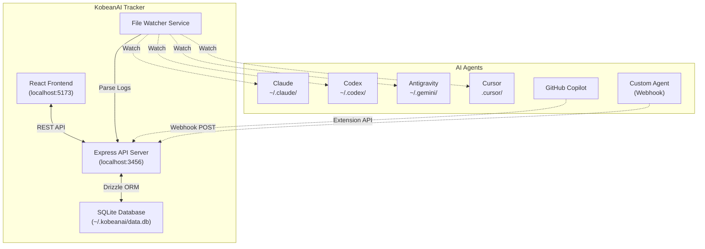

# KobeanAI Tracker — Product & Engineering Specification

> **Version:** 1.0.0  
> **Author:** Nguyen Thai Minh Thien (Joseph)  
> **License:** MIT  
> **Last Updated:** 2026-08-10  
> **Status:** Draft — Pending Review

---

## Table of Contents

- [1. Executive Summary](#1-executive-summary)
- [2. Problem Statement](#2-problem-statement)
- [3. Product Vision & Goals](#3-product-vision--goals)
- [4. Target Users & Personas](#4-target-users--personas)
- [5. Core Concepts & Terminology](#5-core-concepts--terminology)
- [6. Tag System Specification](#6-tag-system-specification)
- [7. Feature Requirements](#7-feature-requirements)
  - [7.1 Setup Wizard (Landing Page)](#71-setup-wizard-landing-page)
  - [7.2 Dashboard](#72-dashboard)
  - [7.3 AI Usage Tracker](#73-ai-usage-tracker)
  - [7.4 Skill Manager](#74-skill-manager)
  - [7.5 Command Registry](#75-command-registry)
  - [7.6 Rules Engine](#76-rules-engine)
  - [7.7 Agent Integration Hub](#77-agent-integration-hub)
  - [7.8 Tag Explorer & Analytics](#78-tag-explorer--analytics)
  - [7.9 Settings & Configuration](#79-settings--configuration)
- [8. Architecture & Technical Design](#8-architecture--technical-design)
  - [8.1 Platform Strategy](#81-platform-strategy)
  - [8.2 Technology Stack](#82-technology-stack)
  - [8.3 Data Architecture](#83-data-architecture)
  - [8.4 Project Structure](#84-project-structure)
  - [8.5 Integration Architecture](#85-integration-architecture)
- [9. UI/UX Design System](#9-uiux-design-system)
- [10. Non-Functional Requirements](#10-non-functional-requirements)
- [11. Setup Wizard — Prerequisite Checklist](#11-setup-wizard--prerequisite-checklist)
- [12. Implementation Phases](#12-implementation-phases)
- [13. Development Guidelines](#13-development-guidelines)
- [14. Future Roadmap](#14-future-roadmap)

---

## 1. Executive Summary

**KobeanAI Tracker** is a **local-first**, privacy-respecting desktop/web application that provides developers with a unified control center to:

1. **Track** AI agent usage across multiple tools (Claude, Codex, Antigravity, Cursor, Copilot, etc.)
2. **Manage** reusable skills, commands, and rules that govern AI behavior
3. **Organize** all interactions via a powerful, convention-based **tag system** (e.g., `[us-1234][explore]`, `[de-15915][debug]`)
4. **Analyze** usage patterns, cost, token consumption, and productivity metrics

The application prioritizes **simplicity**, **elegance**, and **zero-friction onboarding** through a guided setup wizard.

---

## 2. Problem Statement

Modern developers interact with 3–7 different AI coding agents daily. This creates:

| Problem | Impact |
|:---|:---|
| **No unified view** of AI interactions | Cannot correlate work across agents |
| **Scattered skills/rules** | Duplicated prompts, inconsistent AI behavior |
| **No cost visibility** | Untracked token spend across providers |
| **No tag-based workflow** | Impossible to tie AI work to tickets/user stories |
| **Complex setup** | Each tool has its own config; onboarding is painful |

---

## 3. Product Vision & Goals

### Vision

> *"One place to see, control, and optimize every AI interaction in your development workflow."*

### Goals

| # | Goal | Success Metric |
|:--|:-----|:---------------|
| G1 | Unified AI usage visibility | All agent interactions queryable in one dashboard |
| G2 | Tag-driven organization | 100% of tracked sessions linked to at least one tag |
| G3 | Reusable skill/rule library | Skills importable/exportable as `.json` or `.yaml` |
| G4 | Zero-friction onboarding | Setup wizard completable in < 5 minutes |
| G5 | Local-first privacy | All data stored locally by default; no telemetry without opt-in |
| G6 | Multi-agent integration | Support ≥ 5 AI agents at launch |

---

## 4. Target Users & Personas

### Primary: The Power Developer

- Uses 2+ AI coding agents daily
- Works on multiple projects/tickets simultaneously
- Needs to track which AI helped with which task
- Cares about cost and token efficiency

### Secondary: The Team Lead

- Wants visibility into team AI usage patterns
- Needs to standardize skills and rules across the team
- Requires cost reporting per project/sprint

### Tertiary: The AI-Curious Developer

- Just starting with AI tools
- Needs guided setup and sensible defaults
- Values simplicity over configurability

---

## 5. Core Concepts & Terminology

| Term | Definition |
|:-----|:-----------|
| **Session** | A single conversation or interaction with an AI agent, from first prompt to last response |
| **Tag** | A structured label following the `[prefix-id][action]` convention, linking a session to a ticket, project, or workflow phase |
| **Skill** | A reusable prompt template, instruction set, or capability definition that can be loaded into an AI agent |
| **Command** | A named, executable action (e.g., `/analyze`, `/refactor`) that triggers a specific skill or workflow |
| **Rule** | A behavioral constraint or guideline applied to AI agents (e.g., "Always use TypeScript strict mode") |
| **Agent** | An external AI coding tool (Claude, Codex, Antigravity, Cursor, etc.) |
| **Connector** | A plugin/adapter that bridges KobeanAI Tracker to a specific AI agent |
| **Workspace** | A project-level grouping that scopes tags, skills, and usage data |

---

## 6. Tag System Specification

The tag system is the **organizational backbone** of KobeanAI Tracker. All sessions, skills, commands, and rules can be tagged.

### 6.1 Tag Format

```
[prefix-id][action]
```

**Examples:**

| Tag | Meaning |
|:----|:--------|
| `[us-1234][explore]` | User Story 1234 — exploration/research phase |
| `[de-15915][debug]` | Defect 15915 — debugging phase |
| `[fe-auth][refactor]` | Feature "auth" — refactoring phase |
| `[sp-42][review]` | Sprint 42 — code review |
| `[arch][design]` | Architecture — design phase |

### 6.2 Tag Anatomy

```
[prefix-id][action]
 │      │    │
 │      │    └── Action: What phase/activity (explore, debug, implement, review, test, deploy, etc.)
 │      └─────── ID: Ticket number, feature name, or free-form identifier
 └────────────── Prefix: Category namespace (us=user story, de=defect, fe=feature, sp=sprint, etc.)
```

### 6.3 Supported Prefixes (Extensible)

| Prefix | Category | Example |
|:-------|:---------|:--------|
| `us` | User Story | `[us-1234]` |
| `de` | Defect/Bug | `[de-5678]` |
| `fe` | Feature | `[fe-auth]` |
| `sp` | Sprint | `[sp-42]` |
| `ep` | Epic | `[ep-onboarding]` |
| `ch` | Chore | `[ch-deps-update]` |
| `arch` | Architecture | `[arch]` |
| `doc` | Documentation | `[doc-api]` |
| `exp` | Experiment | `[exp-new-model]` |
| `learn` | Learning | `[learn-rust]` |

### 6.4 Supported Actions (Extensible)

| Action | Phase |
|:-------|:------|
| `explore` | Research, investigation, discovery |
| `design` | Architecture, system design, planning |
| `implement` | Active coding, building features |
| `debug` | Bug investigation and fixing |
| `refactor` | Code improvement, restructuring |
| `test` | Writing or running tests |
| `review` | Code review, PR review |
| `deploy` | Deployment, release activities |
| `docs` | Writing documentation |
| `optimize` | Performance tuning |

### 6.5 Tag Rules

1. **Case-insensitive** — Tags are normalized to lowercase on storage
2. **Trimmed** — Leading/trailing whitespace is stripped
3. **Multi-tag support** — A session can have multiple tags: `[us-1234][implement] [de-5678][debug]`
4. **Auto-suggestion** — The UI auto-completes known prefixes, IDs, and actions
5. **Custom tags** — Users can define custom prefixes and actions at any time
6. **Tag inheritance** — Child sessions inherit parent session tags by default

---

## 7. Feature Requirements

### 7.1 Setup Wizard (Landing Page)

> **Priority:** P0 — Must Have  
> **Goal:** Guide first-time users through environment setup in a step-by-step checklist.

The setup wizard is the **first screen** users see. It must feel welcoming, informative, and non-intimidating.

#### Wizard Steps

| Step | Name | Description |
|:-----|:-----|:------------|
| 1 | **Welcome** | Brief product intro, value proposition, and "Get Started" CTA |
| 2 | **System Check** | Auto-detect OS, runtime versions, and installed tools |
| 3 | **Prerequisites** | Checklist of required tools with install status and one-click install links |
| 4 | **Agent Connections** | Configure which AI agents to connect (API keys, paths, etc.) |
| 5 | **Workspace Setup** | Create first workspace, set default tags and preferences |
| 6 | **Import (Optional)** | Import existing skills/rules from files or other tools |
| 7 | **Confirmation** | Summary of setup, "Launch Dashboard" CTA |

#### Prerequisites Checklist (Step 3)

Each item shows: ✅ Installed / ❌ Not Found / ⚠️ Outdated

| Category | Tool | Required Version | Purpose | Install Command |
|:---------|:-----|:-----------------|:--------|:----------------|
| **Runtime** | Node.js | ≥ 20.x LTS | Application runtime | `brew install node` / `nvm install 20` |
| **Runtime** | npm / pnpm | ≥ 9.x / ≥ 9.x | Package management | Bundled with Node.js / `npm i -g pnpm` |
| **Database** | SQLite | ≥ 3.40 | Local data storage | Bundled (via `better-sqlite3`) |
| **VCS** | Git | ≥ 2.40 | Version control, skill sync | `brew install git` |
| **AI Agent** | Claude CLI / API Key | Latest | Anthropic integration | [claude.ai/settings](https://claude.ai/settings) |
| **AI Agent** | Codex CLI | Latest | OpenAI Codex integration | `npm i -g @openai/codex` |
| **AI Agent** | Antigravity CLI | Latest | Google Antigravity integration | `npm i -g @anthropic-ai/claude-code` |
| **AI Agent** | Cursor | Latest | Cursor IDE integration | [cursor.com](https://cursor.com) |
| **Optional** | Docker | ≥ 24.x | Containerized deployment | `brew install docker` |
| **Optional** | Python | ≥ 3.11 | Script-based skills | `brew install python@3.11` |

#### Wizard UI Requirements

- **Progress indicator** — Horizontal stepper bar showing current step and completion
- **Skip capability** — Non-critical steps are skippable
- **Offline support** — Wizard works offline; install links open in browser only when clicked
- **Persistence** — Wizard state persists across app restarts (resume where you left off)
- **Re-run** — Accessible from Settings at any time

---

### 7.2 Dashboard

> **Priority:** P0 — Must Have

The dashboard is the **home screen** after setup. It provides a bird's-eye view of all AI activity.

#### Dashboard Widgets

| Widget | Content |
|:-------|:--------|
| **Activity Feed** | Real-time stream of recent AI sessions with tags, agent name, and timestamp |
| **Usage Summary** | Today / This Week / This Month token counts, session counts, estimated cost |
| **Tag Cloud** | Visual tag frequency map; clickable to filter |
| **Active Agents** | Status indicators for connected AI agents (online/offline/error) |
| **Quick Actions** | Buttons: New Session, Browse Skills, View Rules, Open Settings |
| **Recent Tags** | Last 10 used tags with one-click reuse |

---

### 7.3 AI Usage Tracker

> **Priority:** P0 — Must Have

#### Data Points Captured Per Session

| Field | Type | Description |
|:------|:-----|:------------|
| `id` | UUID | Unique session identifier |
| `agent` | string | Which AI agent was used |
| `model` | string | Specific model (e.g., `claude-opus-4`, `gpt-4.1`) |
| `tags` | string[] | Array of tags applied to this session |
| `started_at` | datetime | Session start timestamp |
| `ended_at` | datetime | Session end timestamp |
| `duration_ms` | integer | Total session duration in milliseconds |
| `input_tokens` | integer | Tokens sent to the model |
| `output_tokens` | integer | Tokens received from the model |
| `total_tokens` | integer | Sum of input + output tokens |
| `estimated_cost` | decimal | Estimated cost in USD based on model pricing |
| `workspace` | string | Associated workspace |
| `status` | enum | `active`, `completed`, `error`, `cancelled` |
| `summary` | string | AI-generated or user-provided session summary |
| `tool_calls` | integer | Number of tool/function calls made |
| `files_modified` | string[] | List of files touched during the session |
| `metadata` | json | Extensible key-value store for agent-specific data |

#### Tracker Views

1. **List View** — Sortable, filterable table of all sessions
2. **Timeline View** — Chronological visualization grouped by day
3. **Tag View** — Sessions grouped by tag, expandable
4. **Agent View** — Sessions grouped by AI agent
5. **Cost View** — Sessions sorted by estimated cost, with aggregations

#### Filtering & Search

- Full-text search across session summaries
- Filter by: tag, agent, model, date range, workspace, cost range, status
- Saved filters (bookmarkable)
- Export to CSV / JSON

---

### 7.4 Skill Manager

> **Priority:** P0 — Must Have

Skills are **reusable prompt templates and instruction sets** that can be loaded into AI agents.

#### Skill Schema

```yaml
# Example: skill.yaml
name: "code-review-expert"
version: "1.2.0"
description: "Performs thorough code review with security and performance focus"
author: "joseph"
tags: ["review", "security", "performance"]
agents: ["claude", "antigravity", "cursor"]  # Compatible agents
trigger: "/review"  # Command that activates this skill

instructions: |
  You are an expert code reviewer. Focus on:
  1. Security vulnerabilities (OWASP Top 10)
  2. Performance bottlenecks
  3. Code clarity and maintainability
  4. Test coverage gaps
  
  Format your review as:
  ## Summary
  ## Critical Issues
  ## Suggestions
  ## Praise

parameters:
  - name: "focus"
    type: "enum"
    values: ["security", "performance", "all"]
    default: "all"
  - name: "severity_threshold"
    type: "enum"
    values: ["info", "warning", "critical"]
    default: "warning"

metadata:
  created_at: "2026-08-10"
  updated_at: "2026-08-10"
  usage_count: 0
```

#### Skill Manager Features

| Feature | Description |
|:--------|:------------|
| **CRUD** | Create, read, update, delete skills |
| **Search & Filter** | By name, tag, agent compatibility, author |
| **Version History** | Track skill changes over time |
| **Import/Export** | `.yaml`, `.json`, or `.md` formats |
| **Marketplace (Future)** | Browse and install community skills |
| **Usage Analytics** | Track how often each skill is used, by whom, and with what results |
| **Duplicate Detection** | Warn when creating skills similar to existing ones |
| **Agent Sync** | Push skills to connected agents' config directories |

---

### 7.5 Command Registry

> **Priority:** P1 — Should Have

Commands are **named shortcuts** that trigger skills or workflows.

#### Command Schema

```yaml
name: "/review"
description: "Trigger a comprehensive code review"
skill: "code-review-expert"          # Linked skill
aliases: ["/cr", "/code-review"]     # Alternative triggers
parameters:
  - name: "files"
    type: "string[]"
    required: false
    description: "Specific files to review"
agents: ["claude", "antigravity"]    # Which agents support this command
tags_auto: ["review"]                # Auto-applied tags when this command runs
```

#### Command Registry Features

- Register, edit, delete commands
- Map commands to skills (1:many)
- Command aliases
- Parameter validation
- Auto-tagging on command execution
- Command usage statistics

---

### 7.6 Rules Engine

> **Priority:** P1 — Should Have

Rules are **behavioral constraints** applied globally or per-workspace/agent.

#### Rule Schema

```yaml
name: "enforce-typescript-strict"
scope: "workspace"                    # global | workspace | agent | tag
target: "all"                         # Which workspaces/agents this applies to
priority: 100                         # Higher = applied first
enabled: true
condition: "language == 'typescript'" # When this rule activates
instruction: |
  Always use TypeScript strict mode. Enable:
  - strict: true
  - noImplicitAny: true
  - strictNullChecks: true
  Never use `any` type unless explicitly approved.
tags: ["quality", "typescript"]
```

#### Rules Engine Features

| Feature | Description |
|:--------|:------------|
| **Scope Hierarchy** | Global → Workspace → Agent → Tag (most specific wins) |
| **Priority System** | Numeric priority for conflict resolution |
| **Conditional Rules** | Activate based on language, file type, tag, or custom conditions |
| **Enable/Disable** | Toggle rules without deleting them |
| **Conflict Detection** | Warn when rules contradict each other |
| **Import/Export** | Share rule sets across teams |
| **Audit Log** | Track when rules are applied and their effect |

---

### 7.7 Agent Integration Hub

> **Priority:** P0 — Must Have

Central configuration for connecting to AI agents.

#### Supported Agents (v1.0)

| Agent | Integration Method | Data Source |
|:------|:-------------------|:------------|
| **Claude** (Anthropic) | API Key + CLI log parsing | `~/.claude/` directory, API responses |
| **Codex** (OpenAI) | API Key + CLI log parsing | `~/.codex/` directory, API responses |
| **Antigravity** (Google) | Local file system monitoring | `~/.gemini/` directory |
| **Cursor** | Extension API + workspace config | `.cursor/` directory |
| **GitHub Copilot** | Extension telemetry (opt-in) | VS Code extension API |
| **Custom Agent** | Webhook / File watcher / API | User-defined |

#### Connector Interface

Each agent connector must implement:

```typescript
interface AgentConnector {
  id: string;
  name: string;
  version: string;
  status: 'connected' | 'disconnected' | 'error';
  
  // Lifecycle
  connect(config: AgentConfig): Promise<void>;
  disconnect(): Promise<void>;
  healthCheck(): Promise<HealthStatus>;
  
  // Data
  getSessions(filter?: SessionFilter): Promise<Session[]>;
  getActiveSession(): Promise<Session | null>;
  
  // Skills
  pushSkill(skill: Skill): Promise<void>;
  removeSkill(skillId: string): Promise<void>;
  listInstalledSkills(): Promise<Skill[]>;
  
  // Rules
  pushRule(rule: Rule): Promise<void>;
  removeRule(ruleId: string): Promise<void>;
  
  // Events
  onSessionStart(callback: (session: Session) => void): void;
  onSessionEnd(callback: (session: Session) => void): void;
  onError(callback: (error: Error) => void): void;
}
```

---

### 7.8 Tag Explorer & Analytics

> **Priority:** P1 — Should Have

#### Analytics Views

| View | Description |
|:-----|:------------|
| **Tag Heatmap** | Calendar heatmap showing activity intensity per tag |
| **Cost by Tag** | Bar/pie chart of estimated cost per tag over time |
| **Agent Distribution** | Which agents are used for which tags |
| **Time Allocation** | How much time is spent per tag/action |
| **Token Efficiency** | Tokens per session by tag, identifying inefficient patterns |
| **Trend Analysis** | Week-over-week usage trends |

---

### 7.9 Settings & Configuration

> **Priority:** P1 — Should Have

| Setting | Description | Default |
|:--------|:------------|:--------|
| **Theme** | Light / Dark / System | System |
| **Data Directory** | Where local database is stored | `~/.kobeanai/` |
| **Auto-tag** | Auto-apply tags based on patterns | Enabled |
| **Cost Rates** | Per-model token pricing for cost estimation | Pre-populated |
| **Export Format** | Default export format (CSV/JSON/YAML) | JSON |
| **Retention** | How long to keep session data | 365 days |
| **Notifications** | Alert on cost thresholds, errors | Enabled |
| **Backup** | Auto-backup schedule | Daily |
| **Re-run Setup** | Re-launch the setup wizard | — |

---

## 8. Architecture & Technical Design

### 8.1 Platform Strategy

**Primary:** Web application (runs locally via `localhost`)  
**Secondary (Phase 2):** Desktop app via Tauri (optional packaging)  
**Tertiary (Phase 3):** Browser extension for in-context tracking

#### Rationale

| Decision | Why |
|:---------|:----|
| **Web-first** | Maximum portability; works on macOS, Windows, Linux without platform-specific builds |
| **Local server** | Privacy-first; data never leaves the machine |
| **Tauri later** | Tauri v2 provides native shell access and tiny binaries (3–15 MB) when desktop packaging is needed |
| **No Electron** | Avoids 100+ MB bloat for what is fundamentally a dashboard application |

### 8.2 Technology Stack

| Layer | Technology | Version | Rationale |
|:------|:-----------|:--------|:----------|
| **Frontend Framework** | React | 19.x | Component model, ecosystem, developer familiarity |
| **Build Tool** | Vite | 6.x | Fast HMR, ESM-native, minimal config |
| **Language** | TypeScript | 5.x | Type safety, better DX, self-documenting code |
| **Styling** | Vanilla CSS + CSS Custom Properties | — | Maximum control, no framework dependency, design token system |
| **State Management** | Zustand | 5.x | Minimal boilerplate, TypeScript-first |
| **Routing** | React Router | 7.x | Standard, file-based routing support |
| **Backend** | Express.js (or Fastify) | 5.x / 5.x | Lightweight local API server |
| **Database** | SQLite via `better-sqlite3` | 11.x | Zero-config, local-first, single-file database |
| **ORM/Query** | Drizzle ORM | Latest | Type-safe SQL, lightweight, SQLite-native |
| **File Watching** | chokidar | 4.x | Cross-platform file system monitoring for agent logs |
| **Testing** | Vitest + Testing Library | Latest | Fast, Vite-native, React component testing |
| **Linting** | ESLint + Prettier | Latest | Code quality and consistency |
| **Icons** | Lucide React | Latest | Clean, consistent icon set |
| **Charts** | Recharts or Chart.js | Latest | Analytics visualizations |
| **Package Manager** | pnpm | 9.x | Fast, disk-efficient, strict dependency resolution |

### 8.3 Data Architecture

#### Entity Relationship Diagram

```mermaid
erDiagram
    WORKSPACE ||--o{ SESSION : contains
    WORKSPACE ||--o{ SKILL : scopes
    WORKSPACE ||--o{ RULE : scopes
    SESSION ||--o{ SESSION_TAG : has
    TAG ||--o{ SESSION_TAG : applied_to
    SKILL ||--o{ SKILL_TAG : has
    TAG ||--o{ SKILL_TAG : applied_to
    COMMAND ||--o| SKILL : triggers
    RULE ||--o{ RULE_TAG : has
    TAG ||--o{ RULE_TAG : applied_to
    AGENT ||--o{ SESSION : records
    AGENT ||--o{ AGENT_SKILL : supports
    SKILL ||--o{ AGENT_SKILL : compatible_with

    WORKSPACE {
        text id PK
        text name
        text path
        text description
        datetime created_at
        datetime updated_at
    }

    SESSION {
        text id PK
        text agent_id FK
        text workspace_id FK
        text model
        datetime started_at
        datetime ended_at
        integer duration_ms
        integer input_tokens
        integer output_tokens
        integer total_tokens
        real estimated_cost
        text status
        text summary
        integer tool_calls
        text files_modified
        text metadata
    }

    TAG {
        text id PK
        text prefix
        text identifier
        text action
        text raw
        text color
        datetime created_at
    }

    SESSION_TAG {
        text session_id FK
        text tag_id FK
    }

    SKILL {
        text id PK
        text workspace_id FK
        text name
        text version
        text description
        text author
        text trigger_command
        text instructions
        text parameters
        integer usage_count
        boolean enabled
        datetime created_at
        datetime updated_at
    }

    SKILL_TAG {
        text skill_id FK
        text tag_id FK
    }

    COMMAND {
        text id PK
        text name
        text description
        text skill_id FK
        text aliases
        text parameters
        text agents
        text auto_tags
        integer usage_count
        datetime created_at
    }

    RULE {
        text id PK
        text workspace_id FK
        text name
        text scope
        text target
        integer priority
        boolean enabled
        text condition
        text instruction
        datetime created_at
        datetime updated_at
    }

    RULE_TAG {
        text rule_id FK
        text tag_id FK
    }

    AGENT {
        text id PK
        text name
        text type
        text config
        text status
        datetime last_sync
        datetime created_at
    }

    AGENT_SKILL {
        text agent_id FK
        text skill_id FK
    }
```



#### Database Indexes

```sql
-- Performance-critical indexes
CREATE INDEX idx_session_agent ON sessions(agent_id);
CREATE INDEX idx_session_workspace ON sessions(workspace_id);
CREATE INDEX idx_session_started ON sessions(started_at DESC);
CREATE INDEX idx_session_status ON sessions(status);
CREATE INDEX idx_tag_prefix ON tags(prefix);
CREATE INDEX idx_tag_raw ON tags(raw);
CREATE UNIQUE INDEX idx_session_tag ON session_tags(session_id, tag_id);
CREATE UNIQUE INDEX idx_skill_tag ON skill_tags(skill_id, tag_id);
CREATE UNIQUE INDEX idx_rule_tag ON rule_tags(rule_id, tag_id);
CREATE INDEX idx_skill_name ON skills(name);
CREATE INDEX idx_command_name ON commands(name);
CREATE INDEX idx_rule_scope ON rules(scope, priority DESC);
```

### 8.4 Project Structure

```
kobeanai-tracker/
├── README.md
├── LICENSE
├── SPEC.md                          # This file
├── package.json
├── pnpm-lock.yaml
├── tsconfig.json
├── vite.config.ts
├── drizzle.config.ts
├── .env.example
├── .eslintrc.cjs
├── .prettierrc
├── .gitignore
│
├── public/
│   ├── favicon.svg
│   └── assets/                      # Static assets (logos, icons)
│
├── src/
│   ├── main.tsx                     # App entry point
│   ├── App.tsx                      # Root component + router
│   ├── index.css                    # Global styles + design tokens
│   │
│   ├── components/                  # Shared UI components
│   │   ├── ui/                      # Primitives (Button, Input, Card, Modal, etc.)
│   │   ├── layout/                  # Shell, Sidebar, Header, Footer
│   │   ├── wizard/                  # Setup wizard step components
│   │   ├── dashboard/               # Dashboard widgets
│   │   ├── tags/                    # Tag input, tag cloud, tag badge
│   │   ├── sessions/                # Session list, session detail
│   │   ├── skills/                  # Skill editor, skill card, skill list
│   │   ├── commands/                # Command registry components
│   │   ├── rules/                   # Rule editor, rule list
│   │   ├── agents/                  # Agent status cards, config forms
│   │   └── charts/                  # Analytics chart components
│   │
│   ├── pages/                       # Route-level page components
│   │   ├── SetupWizardPage.tsx
│   │   ├── DashboardPage.tsx
│   │   ├── SessionsPage.tsx
│   │   ├── SkillsPage.tsx
│   │   ├── CommandsPage.tsx
│   │   ├── RulesPage.tsx
│   │   ├── AgentsPage.tsx
│   │   ├── AnalyticsPage.tsx
│   │   └── SettingsPage.tsx
│   │
│   ├── stores/                      # Zustand state stores
│   │   ├── useSessionStore.ts
│   │   ├── useSkillStore.ts
│   │   ├── useTagStore.ts
│   │   ├── useAgentStore.ts
│   │   ├── useWizardStore.ts
│   │   └── useSettingsStore.ts
│   │
│   ├── hooks/                       # Custom React hooks
│   │   ├── useTagParser.ts
│   │   ├── useAgentConnection.ts
│   │   ├── useSessionTracker.ts
│   │   └── useKeyboardShortcuts.ts
│   │
│   ├── lib/                         # Utility functions
│   │   ├── tag-parser.ts            # Tag parsing and validation
│   │   ├── cost-calculator.ts       # Token cost estimation
│   │   ├── formatters.ts            # Date, number, duration formatters
│   │   ├── validators.ts            # Schema validation helpers
│   │   └── constants.ts             # App-wide constants
│   │
│   ├── types/                       # TypeScript type definitions
│   │   ├── session.ts
│   │   ├── skill.ts
│   │   ├── command.ts
│   │   ├── rule.ts
│   │   ├── tag.ts
│   │   ├── agent.ts
│   │   └── index.ts
│   │
│   └── api/                         # API client (talks to local server)
│       ├── client.ts                # HTTP client wrapper
│       ├── sessions.ts
│       ├── skills.ts
│       ├── commands.ts
│       ├── rules.ts
│       ├── tags.ts
│       └── agents.ts
│
├── server/                          # Local Express/Fastify backend
│   ├── index.ts                     # Server entry point
│   ├── routes/
│   │   ├── sessions.ts
│   │   ├── skills.ts
│   │   ├── commands.ts
│   │   ├── rules.ts
│   │   ├── tags.ts
│   │   ├── agents.ts
│   │   ├── analytics.ts
│   │   └── setup.ts                 # System check endpoints
│   │
│   ├── db/
│   │   ├── index.ts                 # Database connection
│   │   ├── schema.ts                # Drizzle schema definitions
│   │   └── migrations/              # Database migrations
│   │
│   ├── connectors/                  # Agent connector implementations
│   │   ├── base.ts                  # Abstract connector class
│   │   ├── claude.ts
│   │   ├── codex.ts
│   │   ├── antigravity.ts
│   │   ├── cursor.ts
│   │   └── custom.ts
│   │
│   ├── services/
│   │   ├── session-tracker.ts       # Core tracking logic
│   │   ├── tag-service.ts           # Tag CRUD + parsing
│   │   ├── skill-service.ts         # Skill management
│   │   ├── rule-engine.ts           # Rule evaluation
│   │   ├── file-watcher.ts          # Agent log file monitoring
│   │   ├── system-check.ts          # Prerequisites detection
│   │   └── cost-service.ts          # Cost calculation
│   │
│   └── middleware/
│       ├── error-handler.ts
│       ├── logger.ts
│       └── cors.ts
│
├── tests/
│   ├── unit/
│   │   ├── tag-parser.test.ts
│   │   ├── cost-calculator.test.ts
│   │   └── rule-engine.test.ts
│   ├── integration/
│   │   ├── sessions.test.ts
│   │   └── connectors.test.ts
│   └── e2e/
│       └── setup-wizard.test.ts
│
└── scripts/
    ├── dev.ts                       # Start dev server (frontend + backend)
    ├── build.ts                     # Production build
    ├── migrate.ts                   # Run database migrations
    └── seed.ts                      # Seed sample data for development
```

### 8.5 Integration Architecture



---

## 9. UI/UX Design System

### Design Principles

1. **Clarity over cleverness** — Every element must have a clear purpose
2. **Progressive disclosure** — Show basics first, reveal complexity on demand
3. **Consistent patterns** — Same action, same interaction, everywhere
4. **Keyboard-first** — Power users can navigate entirely via keyboard
5. **Dark mode default** — Developer-friendly; respect system preference

### Color Palette (CSS Custom Properties)

```css
:root {
  /* Background */
  --bg-primary: #0a0a0f;
  --bg-secondary: #12121a;
  --bg-tertiary: #1a1a2e;
  --bg-elevated: #16213e;
  
  /* Foreground */
  --fg-primary: #e8e8f0;
  --fg-secondary: #a0a0b8;
  --fg-muted: #6b6b80;
  
  /* Accent */
  --accent-primary: #6c63ff;
  --accent-secondary: #3b82f6;
  --accent-success: #22c55e;
  --accent-warning: #f59e0b;
  --accent-error: #ef4444;
  --accent-info: #06b6d4;
  
  /* Tag Colors (mapped to prefixes) */
  --tag-us: #8b5cf6;    /* User Story — purple */
  --tag-de: #ef4444;    /* Defect — red */
  --tag-fe: #3b82f6;    /* Feature — blue */
  --tag-sp: #22c55e;    /* Sprint — green */
  --tag-ep: #f59e0b;    /* Epic — amber */
  --tag-ch: #6b7280;    /* Chore — gray */
  --tag-arch: #06b6d4;  /* Architecture — cyan */
  --tag-doc: #ec4899;   /* Documentation — pink */
  --tag-exp: #f97316;   /* Experiment — orange */
  --tag-learn: #a855f7; /* Learning — violet */
  
  /* Borders & Surfaces */
  --border-subtle: rgba(255, 255, 255, 0.06);
  --border-default: rgba(255, 255, 255, 0.1);
  --surface-glass: rgba(255, 255, 255, 0.03);
  
  /* Spacing scale */
  --space-xs: 0.25rem;
  --space-sm: 0.5rem;
  --space-md: 1rem;
  --space-lg: 1.5rem;
  --space-xl: 2rem;
  --space-2xl: 3rem;
  
  /* Typography */
  --font-sans: 'Inter', -apple-system, BlinkMacSystemFont, system-ui, sans-serif;
  --font-mono: 'JetBrains Mono', 'Fira Code', monospace;
  
  /* Radius */
  --radius-sm: 6px;
  --radius-md: 10px;
  --radius-lg: 16px;
  --radius-full: 9999px;
  
  /* Shadows */
  --shadow-sm: 0 1px 2px rgba(0, 0, 0, 0.3);
  --shadow-md: 0 4px 12px rgba(0, 0, 0, 0.4);
  --shadow-lg: 0 8px 32px rgba(0, 0, 0, 0.5);
  --shadow-glow: 0 0 20px rgba(108, 99, 255, 0.15);
  
  /* Transitions */
  --transition-fast: 150ms cubic-bezier(0.4, 0, 0.2, 1);
  --transition-normal: 250ms cubic-bezier(0.4, 0, 0.2, 1);
  --transition-slow: 350ms cubic-bezier(0.4, 0, 0.2, 1);
}
```

### Typography Scale

| Token | Size | Weight | Usage |
|:------|:-----|:-------|:------|
| `--text-xs` | 0.75rem | 400 | Captions, metadata |
| `--text-sm` | 0.875rem | 400 | Secondary text, labels |
| `--text-base` | 1rem | 400 | Body text |
| `--text-lg` | 1.125rem | 500 | Subheadings |
| `--text-xl` | 1.25rem | 600 | Section headings |
| `--text-2xl` | 1.5rem | 700 | Page headings |
| `--text-3xl` | 2rem | 800 | Hero text |

### Keyboard Shortcuts

| Shortcut | Action |
|:---------|:-------|
| `⌘ + K` | Command palette (global search) |
| `⌘ + N` | New session |
| `⌘ + T` | Quick tag input |
| `⌘ + /` | Toggle sidebar |
| `⌘ + 1–9` | Navigate to page (Dashboard, Sessions, etc.) |
| `⌘ + ,` | Open settings |
| `Esc` | Close modal / cancel action |

---

## 10. Non-Functional Requirements

| Requirement | Target | Notes |
|:------------|:-------|:------|
| **Startup Time** | < 2 seconds | Cold start to interactive dashboard |
| **Query Latency** | < 100ms | For tag search and session listing |
| **Database Size** | < 500 MB for 1 year of data | SQLite with proper indexing and retention |
| **Memory Usage** | < 200 MB | Typical browser tab footprint |
| **Offline Support** | Full functionality | No internet required for core features |
| **Data Privacy** | 100% local by default | No external API calls for tracking data |
| **Accessibility** | WCAG 2.1 AA | Keyboard navigation, screen reader support, contrast ratios |
| **Browser Support** | Chrome 120+, Firefox 120+, Safari 17+ | Modern browsers only |
| **Responsiveness** | Desktop-first, usable at 1024px+ | Not targeting mobile |

---

## 11. Setup Wizard — Prerequisite Checklist

> This is the **exact checklist** rendered in the Setup Wizard's Step 3.

### System Requirements

```
┌─────────────────────────────────────────────────────────────────────┐
│  ☐  System Check                                                    │
│                                                                     │
│  Operating System:    macOS 15.x / Windows 11 / Ubuntu 22.04+       │
│  Free Disk Space:     ≥ 500 MB                                      │
│  RAM:                 ≥ 4 GB                                        │
└─────────────────────────────────────────────────────────────────────┘
```

### Required Tools

```
┌─────────────────────────────────────────────────────────────────────┐
│  Step 1 of 3: Required Tools                                        │
│                                                                     │
│  ✅  Node.js 20.x LTS         v20.18.0 detected                    │
│  ✅  pnpm 9.x                 v9.15.0 detected                     │
│  ✅  Git 2.40+                v2.45.2 detected                     │
│  ✅  SQLite 3.40+             Bundled via better-sqlite3            │
│                                                                     │
│  ❌  Python 3.11+             Not found                             │
│      → brew install python@3.11                                     │
│      [Install] [Skip — Optional]                                    │
│                                                                     │
│  [← Back]                              [Next: Agent Setup →]        │
└─────────────────────────────────────────────────────────────────────┘
```

### Agent Connections

```
┌─────────────────────────────────────────────────────────────────────┐
│  Step 2 of 3: Connect Your AI Agents                                │
│                                                                     │
│  Select the agents you use. You can add more later in Settings.     │
│                                                                     │
│  ☑  Claude (Anthropic)                                              │
│     API Key: ••••••••••••sk-abc    [Test Connection ✅]             │
│     Log Directory: ~/.claude/      [Auto-detected]                  │
│                                                                     │
│  ☑  Antigravity (Google)                                            │
│     Directory: ~/.gemini/          [Auto-detected ✅]               │
│                                                                     │
│  ☐  Codex (OpenAI)                                                  │
│  ☐  Cursor                                                          │
│  ☐  GitHub Copilot                                                  │
│  ☐  Custom Agent                                                    │
│                                                                     │
│  [← Back]                              [Next: Workspace →]          │
└─────────────────────────────────────────────────────────────────────┘
```

### Workspace Setup

```
┌─────────────────────────────────────────────────────────────────────┐
│  Step 3 of 3: Create Your First Workspace                           │
│                                                                     │
│  Workspace Name:   [KobeanAI-tracker                    ]           │
│  Project Path:     [~/Desktop/KobeanAI-tracker          ] [Browse]  │
│                                                                     │
│  Default Tag Prefixes:                                              │
│  ☑ us (User Story)   ☑ de (Defect)   ☑ fe (Feature)               │
│  ☑ sp (Sprint)       ☐ ep (Epic)     ☐ ch (Chore)                 │
│  ☑ arch (Architecture)                                              │
│                                                                     │
│  [← Back]                              [🚀 Launch Dashboard]        │
└─────────────────────────────────────────────────────────────────────┘
```

---

## 12. Implementation Phases

### Phase 1: Foundation (Weeks 1–3)

> **Goal:** Core infrastructure, setup wizard, basic session tracking

| Task | Priority | Est. |
|:-----|:---------|:-----|
| Project scaffolding (Vite + React + TypeScript) | P0 | 1d |
| Design system: CSS custom properties, base components | P0 | 2d |
| SQLite database setup + Drizzle schema + migrations | P0 | 2d |
| Express API server with CRUD routes | P0 | 2d |
| Setup Wizard (all 7 steps) | P0 | 3d |
| System check service (detect installed tools) | P0 | 1d |
| Tag parser library with validation | P0 | 1d |
| Basic session tracking (manual entry) | P0 | 2d |
| Dashboard with activity feed | P0 | 2d |

### Phase 2: Core Features (Weeks 4–6)

> **Goal:** Skill manager, rule engine, first agent connectors

| Task | Priority | Est. |
|:-----|:---------|:-----|
| Skill manager (CRUD + editor) | P0 | 3d |
| Skill import/export (YAML, JSON) | P0 | 1d |
| Command registry | P1 | 2d |
| Rules engine (scoped rules with priorities) | P1 | 3d |
| Claude connector (log parsing) | P0 | 2d |
| Antigravity connector (file watching) | P0 | 2d |
| Agent connection health checks | P0 | 1d |

### Phase 3: Intelligence (Weeks 7–9)

> **Goal:** Analytics, auto-tracking, advanced search

| Task | Priority | Est. |
|:-----|:---------|:-----|
| Tag explorer + analytics views | P1 | 3d |
| Cost calculator service | P1 | 1d |
| Full-text search across sessions | P1 | 2d |
| Saved filters and bookmarks | P1 | 1d |
| Auto-tag based on content patterns | P2 | 2d |
| Session timeline view | P1 | 2d |
| CSV/JSON export | P1 | 1d |
| Codex connector | P1 | 2d |
| Cursor connector | P1 | 2d |

### Phase 4: Polish (Weeks 10–12)

> **Goal:** UX refinement, testing, documentation

| Task | Priority | Est. |
|:-----|:---------|:-----|
| Keyboard shortcuts + command palette | P1 | 2d |
| Notification system (cost alerts, errors) | P2 | 2d |
| Auto-backup to file | P2 | 1d |
| E2E tests for critical flows | P1 | 3d |
| Performance optimization | P1 | 2d |
| User documentation | P1 | 2d |
| Accessibility audit (WCAG 2.1 AA) | P1 | 2d |

---

## 13. Development Guidelines

### Code Quality

- **TypeScript strict mode** — `strict: true` in `tsconfig.json`
- **No `any`** — All types must be explicit
- **ESLint** — Enforce consistent code style with `@typescript-eslint/recommended`
- **Prettier** — Auto-format on save
- **Conventional Commits** — `feat:`, `fix:`, `docs:`, `refactor:`, `test:`, `chore:`

### Component Guidelines

- **One component per file** — Named exports only
- **Colocation** — Component-specific styles and tests live next to the component
- **Props interfaces** — Every component has an explicit `Props` type
- **No prop drilling** — Use Zustand stores for shared state (max 2 levels of prop passing)
- **Composition over inheritance** — Prefer compound components and render props

### API Guidelines

- **RESTful conventions** — `GET /api/sessions`, `POST /api/sessions`, etc.
- **Consistent error responses** — `{ error: string, code: string, details?: any }`
- **Input validation** — Validate all inputs with Zod schemas at the API boundary
- **Pagination** — Default page size of 50, cursor-based pagination for large datasets

### Database Guidelines

- **Migrations only** — Never modify the database schema manually
- **UUIDs** — Use `crypto.randomUUID()` for all primary keys
- **Soft deletes** — Use `deleted_at` timestamp instead of `DELETE` for auditable entities
- **Timestamps** — All tables have `created_at` and `updated_at` (ISO 8601)

---

## 14. Future Roadmap

| Phase | Feature | Description |
|:------|:--------|:------------|
| **v1.1** | Tauri Desktop App | Package as native desktop app (3–15 MB binary) |
| **v1.2** | Browser Extension | Track AI usage directly in browser-based tools |
| **v1.3** | Team Sync | Share skills, rules, and analytics across a team via Git |
| **v1.4** | Skill Marketplace | Community-contributed skill library |
| **v1.5** | AI-Powered Insights | Use local LLM to suggest optimizations, detect patterns |
| **v2.0** | MCP Integration | Expose KobeanAI as an MCP server for agent-to-tracker communication |
| **v2.1** | Plugin System | Third-party plugins for custom agents and data sources |
| **v2.2** | Workflow Automation | Chain skills into multi-step workflows with triggers |

---

> **End of Specification**  
> 
> This document is the single source of truth for the KobeanAI Tracker project.  
> All implementation decisions should reference this spec. If reality diverges from the spec, update the spec first.

---

*Built with ❤️ by [Joseph](https://github.com/thienng-it) — MIT License*
