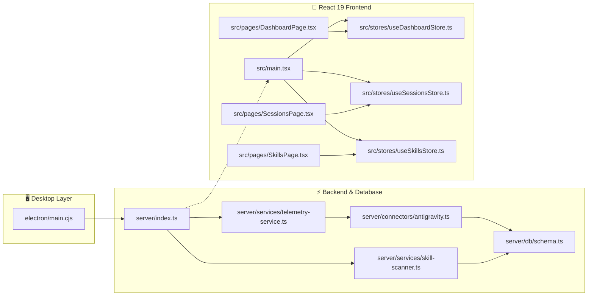

# KobeanAI Tracker — Interactive Code Graph & Dependency Map

> **Auto-Generated Codegraph**: This document provides an architectural map of all module connections, data flows, and dependencies across the desktop, server, database, and client layers.

*Last Generated: 2026-08-15T12:24:50.019Z*

## 1. High-Level Architectural Flow

## 2. Module Dependency Matrix

| Module | Category | Outgoing Dependencies (Imports) | Incoming Dependencies (Imported By) |
| :--- | :--- | :--- | :--- |
| [`electron/main.cjs`](file:///Users/josephnguyen/Desktop/KobeanAI-tracker/electron/main.cjs) | **Desktop Layer** | *None (Leaf)* | *None (Root/Entry)* |
| [`server/connectors/antigravity.js`](file:///Users/josephnguyen/Desktop/KobeanAI-tracker/server/connectors/antigravity.js) | **Connector Layer** | [`server/connectors/base.js`](file:///Users/josephnguyen/Desktop/KobeanAI-tracker/server/connectors/base.js) [`server/db/index.ts`](file:///Users/josephnguyen/Desktop/KobeanAI-tracker/server/db/index.ts) [`server/db/schema.ts`](file:///Users/josephnguyen/Desktop/KobeanAI-tracker/server/db/schema.ts) | [`server/services/telemetry-service.js`](file:///Users/josephnguyen/Desktop/KobeanAI-tracker/server/services/telemetry-service.js) [`server/services/telemetry-service.ts`](file:///Users/josephnguyen/Desktop/KobeanAI-tracker/server/services/telemetry-service.ts) |
| [`server/connectors/antigravity.ts`](file:///Users/josephnguyen/Desktop/KobeanAI-tracker/server/connectors/antigravity.ts) | **Connector Layer** | [`server/connectors/base.js`](file:///Users/josephnguyen/Desktop/KobeanAI-tracker/server/connectors/base.js) [`server/db/index.ts`](file:///Users/josephnguyen/Desktop/KobeanAI-tracker/server/db/index.ts) [`server/db/schema.ts`](file:///Users/josephnguyen/Desktop/KobeanAI-tracker/server/db/schema.ts) | *None (Root/Entry)* |
| [`server/connectors/base.d.ts`](file:///Users/josephnguyen/Desktop/KobeanAI-tracker/server/connectors/base.d.ts) | **Connector Layer** | *None (Leaf)* | *None (Root/Entry)* |
| [`server/connectors/base.js`](file:///Users/josephnguyen/Desktop/KobeanAI-tracker/server/connectors/base.js) | **Connector Layer** | *None (Leaf)* | [`server/connectors/antigravity.js`](file:///Users/josephnguyen/Desktop/KobeanAI-tracker/server/connectors/antigravity.js) [`server/connectors/antigravity.ts`](file:///Users/josephnguyen/Desktop/KobeanAI-tracker/server/connectors/antigravity.ts) [`server/services/telemetry-service.ts`](file:///Users/josephnguyen/Desktop/KobeanAI-tracker/server/services/telemetry-service.ts) |
| [`server/connectors/base.ts`](file:///Users/josephnguyen/Desktop/KobeanAI-tracker/server/connectors/base.ts) | **Connector Layer** | *None (Leaf)* | *None (Root/Entry)* |
| [`server/db/index.ts`](file:///Users/josephnguyen/Desktop/KobeanAI-tracker/server/db/index.ts) | **Database Layer** | [`server/db/schema.ts`](file:///Users/josephnguyen/Desktop/KobeanAI-tracker/server/db/schema.ts) | [`server/connectors/antigravity.js`](file:///Users/josephnguyen/Desktop/KobeanAI-tracker/server/connectors/antigravity.js) [`server/connectors/antigravity.ts`](file:///Users/josephnguyen/Desktop/KobeanAI-tracker/server/connectors/antigravity.ts) [`server/index.ts`](file:///Users/josephnguyen/Desktop/KobeanAI-tracker/server/index.ts) [`server/routes/agents.ts`](file:///Users/josephnguyen/Desktop/KobeanAI-tracker/server/routes/agents.ts) [`server/routes/commands.ts`](file:///Users/josephnguyen/Desktop/KobeanAI-tracker/server/routes/commands.ts) [`server/routes/dashboard.js`](file:///Users/josephnguyen/Desktop/KobeanAI-tracker/server/routes/dashboard.js) [`server/routes/dashboard.ts`](file:///Users/josephnguyen/Desktop/KobeanAI-tracker/server/routes/dashboard.ts) [`server/routes/health.ts`](file:///Users/josephnguyen/Desktop/KobeanAI-tracker/server/routes/health.ts) [`server/routes/rules.ts`](file:///Users/josephnguyen/Desktop/KobeanAI-tracker/server/routes/rules.ts) [`server/routes/sessions.js`](file:///Users/josephnguyen/Desktop/KobeanAI-tracker/server/routes/sessions.js) [`server/routes/sessions.ts`](file:///Users/josephnguyen/Desktop/KobeanAI-tracker/server/routes/sessions.ts) [`server/routes/skills.js`](file:///Users/josephnguyen/Desktop/KobeanAI-tracker/server/routes/skills.js) [`server/routes/skills.ts`](file:///Users/josephnguyen/Desktop/KobeanAI-tracker/server/routes/skills.ts) [`server/scripts/seed.ts`](file:///Users/josephnguyen/Desktop/KobeanAI-tracker/server/scripts/seed.ts) [`server/services/skill-scanner.js`](file:///Users/josephnguyen/Desktop/KobeanAI-tracker/server/services/skill-scanner.js) [`server/services/skill-scanner.ts`](file:///Users/josephnguyen/Desktop/KobeanAI-tracker/server/services/skill-scanner.ts) [`server/services/telemetry-service.js`](file:///Users/josephnguyen/Desktop/KobeanAI-tracker/server/services/telemetry-service.js) [`server/services/telemetry-service.ts`](file:///Users/josephnguyen/Desktop/KobeanAI-tracker/server/services/telemetry-service.ts) |
| [`server/db/schema.ts`](file:///Users/josephnguyen/Desktop/KobeanAI-tracker/server/db/schema.ts) | **Database Layer** | *None (Leaf)* | [`server/connectors/antigravity.js`](file:///Users/josephnguyen/Desktop/KobeanAI-tracker/server/connectors/antigravity.js) [`server/connectors/antigravity.ts`](file:///Users/josephnguyen/Desktop/KobeanAI-tracker/server/connectors/antigravity.ts) [`server/db/index.ts`](file:///Users/josephnguyen/Desktop/KobeanAI-tracker/server/db/index.ts) [`server/routes/agents.ts`](file:///Users/josephnguyen/Desktop/KobeanAI-tracker/server/routes/agents.ts) [`server/routes/commands.ts`](file:///Users/josephnguyen/Desktop/KobeanAI-tracker/server/routes/commands.ts) [`server/routes/dashboard.js`](file:///Users/josephnguyen/Desktop/KobeanAI-tracker/server/routes/dashboard.js) [`server/routes/dashboard.ts`](file:///Users/josephnguyen/Desktop/KobeanAI-tracker/server/routes/dashboard.ts) [`server/routes/rules.ts`](file:///Users/josephnguyen/Desktop/KobeanAI-tracker/server/routes/rules.ts) [`server/routes/sessions.js`](file:///Users/josephnguyen/Desktop/KobeanAI-tracker/server/routes/sessions.js) [`server/routes/sessions.ts`](file:///Users/josephnguyen/Desktop/KobeanAI-tracker/server/routes/sessions.ts) [`server/routes/skills.js`](file:///Users/josephnguyen/Desktop/KobeanAI-tracker/server/routes/skills.js) [`server/routes/skills.ts`](file:///Users/josephnguyen/Desktop/KobeanAI-tracker/server/routes/skills.ts) [`server/scripts/seed.ts`](file:///Users/josephnguyen/Desktop/KobeanAI-tracker/server/scripts/seed.ts) [`server/services/skill-scanner.js`](file:///Users/josephnguyen/Desktop/KobeanAI-tracker/server/services/skill-scanner.js) [`server/services/skill-scanner.ts`](file:///Users/josephnguyen/Desktop/KobeanAI-tracker/server/services/skill-scanner.ts) |
| [`server/index.js`](file:///Users/josephnguyen/Desktop/KobeanAI-tracker/server/index.js) | **Backend Core** | [`server/services/telemetry-service.js`](file:///Users/josephnguyen/Desktop/KobeanAI-tracker/server/services/telemetry-service.js) [`server/middleware/error.ts`](file:///Users/josephnguyen/Desktop/KobeanAI-tracker/server/middleware/error.ts) [`server/routes/health.ts`](file:///Users/josephnguyen/Desktop/KobeanAI-tracker/server/routes/health.ts) [`server/routes/dashboard.js`](file:///Users/josephnguyen/Desktop/KobeanAI-tracker/server/routes/dashboard.js) [`server/routes/sessions.js`](file:///Users/josephnguyen/Desktop/KobeanAI-tracker/server/routes/sessions.js) [`server/routes/skills.js`](file:///Users/josephnguyen/Desktop/KobeanAI-tracker/server/routes/skills.js) [`server/routes/agents.ts`](file:///Users/josephnguyen/Desktop/KobeanAI-tracker/server/routes/agents.ts) [`server/routes/commands.ts`](file:///Users/josephnguyen/Desktop/KobeanAI-tracker/server/routes/commands.ts) [`server/routes/rules.ts`](file:///Users/josephnguyen/Desktop/KobeanAI-tracker/server/routes/rules.ts) | *None (Root/Entry)* |
| [`server/index.ts`](file:///Users/josephnguyen/Desktop/KobeanAI-tracker/server/index.ts) | **Backend Core** | [`server/db/index.ts`](file:///Users/josephnguyen/Desktop/KobeanAI-tracker/server/db/index.ts) [`server/services/telemetry-service.js`](file:///Users/josephnguyen/Desktop/KobeanAI-tracker/server/services/telemetry-service.js) [`server/middleware/error.ts`](file:///Users/josephnguyen/Desktop/KobeanAI-tracker/server/middleware/error.ts) [`server/routes/health.ts`](file:///Users/josephnguyen/Desktop/KobeanAI-tracker/server/routes/health.ts) [`server/routes/dashboard.js`](file:///Users/josephnguyen/Desktop/KobeanAI-tracker/server/routes/dashboard.js) [`server/routes/sessions.js`](file:///Users/josephnguyen/Desktop/KobeanAI-tracker/server/routes/sessions.js) [`server/routes/skills.js`](file:///Users/josephnguyen/Desktop/KobeanAI-tracker/server/routes/skills.js) [`server/routes/agents.ts`](file:///Users/josephnguyen/Desktop/KobeanAI-tracker/server/routes/agents.ts) [`server/routes/commands.ts`](file:///Users/josephnguyen/Desktop/KobeanAI-tracker/server/routes/commands.ts) [`server/routes/rules.ts`](file:///Users/josephnguyen/Desktop/KobeanAI-tracker/server/routes/rules.ts) | *None (Root/Entry)* |
| [`server/middleware/error.ts`](file:///Users/josephnguyen/Desktop/KobeanAI-tracker/server/middleware/error.ts) | **Backend Core** | *None (Leaf)* | [`server/index.js`](file:///Users/josephnguyen/Desktop/KobeanAI-tracker/server/index.js) [`server/index.ts`](file:///Users/josephnguyen/Desktop/KobeanAI-tracker/server/index.ts) |
| [`server/routes/agents.ts`](file:///Users/josephnguyen/Desktop/KobeanAI-tracker/server/routes/agents.ts) | **API Routes** | [`server/db/index.ts`](file:///Users/josephnguyen/Desktop/KobeanAI-tracker/server/db/index.ts) [`server/db/schema.ts`](file:///Users/josephnguyen/Desktop/KobeanAI-tracker/server/db/schema.ts) | [`server/index.js`](file:///Users/josephnguyen/Desktop/KobeanAI-tracker/server/index.js) [`server/index.ts`](file:///Users/josephnguyen/Desktop/KobeanAI-tracker/server/index.ts) |
| [`server/routes/commands.ts`](file:///Users/josephnguyen/Desktop/KobeanAI-tracker/server/routes/commands.ts) | **API Routes** | [`server/db/index.ts`](file:///Users/josephnguyen/Desktop/KobeanAI-tracker/server/db/index.ts) [`server/db/schema.ts`](file:///Users/josephnguyen/Desktop/KobeanAI-tracker/server/db/schema.ts) | [`server/index.js`](file:///Users/josephnguyen/Desktop/KobeanAI-tracker/server/index.js) [`server/index.ts`](file:///Users/josephnguyen/Desktop/KobeanAI-tracker/server/index.ts) |
| [`server/routes/dashboard.js`](file:///Users/josephnguyen/Desktop/KobeanAI-tracker/server/routes/dashboard.js) | **API Routes** | [`server/db/index.ts`](file:///Users/josephnguyen/Desktop/KobeanAI-tracker/server/db/index.ts) [`server/db/schema.ts`](file:///Users/josephnguyen/Desktop/KobeanAI-tracker/server/db/schema.ts) | [`server/index.js`](file:///Users/josephnguyen/Desktop/KobeanAI-tracker/server/index.js) [`server/index.ts`](file:///Users/josephnguyen/Desktop/KobeanAI-tracker/server/index.ts) |
| [`server/routes/dashboard.ts`](file:///Users/josephnguyen/Desktop/KobeanAI-tracker/server/routes/dashboard.ts) | **API Routes** | [`server/db/index.ts`](file:///Users/josephnguyen/Desktop/KobeanAI-tracker/server/db/index.ts) [`server/db/schema.ts`](file:///Users/josephnguyen/Desktop/KobeanAI-tracker/server/db/schema.ts) | *None (Root/Entry)* |
| [`server/routes/health.ts`](file:///Users/josephnguyen/Desktop/KobeanAI-tracker/server/routes/health.ts) | **API Routes** | [`server/db/index.ts`](file:///Users/josephnguyen/Desktop/KobeanAI-tracker/server/db/index.ts) | [`server/index.js`](file:///Users/josephnguyen/Desktop/KobeanAI-tracker/server/index.js) [`server/index.ts`](file:///Users/josephnguyen/Desktop/KobeanAI-tracker/server/index.ts) |
| [`server/routes/rules.ts`](file:///Users/josephnguyen/Desktop/KobeanAI-tracker/server/routes/rules.ts) | **API Routes** | [`server/db/index.ts`](file:///Users/josephnguyen/Desktop/KobeanAI-tracker/server/db/index.ts) [`server/db/schema.ts`](file:///Users/josephnguyen/Desktop/KobeanAI-tracker/server/db/schema.ts) | [`server/index.js`](file:///Users/josephnguyen/Desktop/KobeanAI-tracker/server/index.js) [`server/index.ts`](file:///Users/josephnguyen/Desktop/KobeanAI-tracker/server/index.ts) |
| [`server/routes/sessions.js`](file:///Users/josephnguyen/Desktop/KobeanAI-tracker/server/routes/sessions.js) | **API Routes** | [`server/db/index.ts`](file:///Users/josephnguyen/Desktop/KobeanAI-tracker/server/db/index.ts) [`server/db/schema.ts`](file:///Users/josephnguyen/Desktop/KobeanAI-tracker/server/db/schema.ts) | [`server/index.js`](file:///Users/josephnguyen/Desktop/KobeanAI-tracker/server/index.js) [`server/index.ts`](file:///Users/josephnguyen/Desktop/KobeanAI-tracker/server/index.ts) |
| [`server/routes/sessions.ts`](file:///Users/josephnguyen/Desktop/KobeanAI-tracker/server/routes/sessions.ts) | **API Routes** | [`server/db/index.ts`](file:///Users/josephnguyen/Desktop/KobeanAI-tracker/server/db/index.ts) [`server/db/schema.ts`](file:///Users/josephnguyen/Desktop/KobeanAI-tracker/server/db/schema.ts) | *None (Root/Entry)* |
| [`server/routes/skills.js`](file:///Users/josephnguyen/Desktop/KobeanAI-tracker/server/routes/skills.js) | **API Routes** | [`server/db/index.ts`](file:///Users/josephnguyen/Desktop/KobeanAI-tracker/server/db/index.ts) [`server/db/schema.ts`](file:///Users/josephnguyen/Desktop/KobeanAI-tracker/server/db/schema.ts) | [`server/index.js`](file:///Users/josephnguyen/Desktop/KobeanAI-tracker/server/index.js) [`server/index.ts`](file:///Users/josephnguyen/Desktop/KobeanAI-tracker/server/index.ts) |
| [`server/routes/skills.ts`](file:///Users/josephnguyen/Desktop/KobeanAI-tracker/server/routes/skills.ts) | **API Routes** | [`server/db/index.ts`](file:///Users/josephnguyen/Desktop/KobeanAI-tracker/server/db/index.ts) [`server/db/schema.ts`](file:///Users/josephnguyen/Desktop/KobeanAI-tracker/server/db/schema.ts) | *None (Root/Entry)* |
| [`server/scripts/seed.ts`](file:///Users/josephnguyen/Desktop/KobeanAI-tracker/server/scripts/seed.ts) | **Backend Core** | [`server/db/index.ts`](file:///Users/josephnguyen/Desktop/KobeanAI-tracker/server/db/index.ts) [`server/db/schema.ts`](file:///Users/josephnguyen/Desktop/KobeanAI-tracker/server/db/schema.ts) | *None (Root/Entry)* |
| [`server/services/skill-scanner.d.ts`](file:///Users/josephnguyen/Desktop/KobeanAI-tracker/server/services/skill-scanner.d.ts) | **Service Layer** | *None (Leaf)* | *None (Root/Entry)* |
| [`server/services/skill-scanner.js`](file:///Users/josephnguyen/Desktop/KobeanAI-tracker/server/services/skill-scanner.js) | **Service Layer** | [`server/db/index.ts`](file:///Users/josephnguyen/Desktop/KobeanAI-tracker/server/db/index.ts) [`server/db/schema.ts`](file:///Users/josephnguyen/Desktop/KobeanAI-tracker/server/db/schema.ts) | *None (Root/Entry)* |
| [`server/services/skill-scanner.ts`](file:///Users/josephnguyen/Desktop/KobeanAI-tracker/server/services/skill-scanner.ts) | **Service Layer** | [`server/db/index.ts`](file:///Users/josephnguyen/Desktop/KobeanAI-tracker/server/db/index.ts) [`server/db/schema.ts`](file:///Users/josephnguyen/Desktop/KobeanAI-tracker/server/db/schema.ts) | *None (Root/Entry)* |
| [`server/services/telemetry-service.js`](file:///Users/josephnguyen/Desktop/KobeanAI-tracker/server/services/telemetry-service.js) | **Service Layer** | [`server/db/index.ts`](file:///Users/josephnguyen/Desktop/KobeanAI-tracker/server/db/index.ts) [`server/connectors/antigravity.js`](file:///Users/josephnguyen/Desktop/KobeanAI-tracker/server/connectors/antigravity.js) | [`server/index.js`](file:///Users/josephnguyen/Desktop/KobeanAI-tracker/server/index.js) [`server/index.ts`](file:///Users/josephnguyen/Desktop/KobeanAI-tracker/server/index.ts) |
| [`server/services/telemetry-service.ts`](file:///Users/josephnguyen/Desktop/KobeanAI-tracker/server/services/telemetry-service.ts) | **Service Layer** | [`server/db/index.ts`](file:///Users/josephnguyen/Desktop/KobeanAI-tracker/server/db/index.ts) [`server/connectors/base.js`](file:///Users/josephnguyen/Desktop/KobeanAI-tracker/server/connectors/base.js) [`server/connectors/antigravity.js`](file:///Users/josephnguyen/Desktop/KobeanAI-tracker/server/connectors/antigravity.js) | *None (Root/Entry)* |
| [`src/App.tsx`](file:///Users/josephnguyen/Desktop/KobeanAI-tracker/src/App.tsx) | **Frontend Core** | [`src/pages/SetupWizardPage.tsx`](file:///Users/josephnguyen/Desktop/KobeanAI-tracker/src/pages/SetupWizardPage.tsx) [`src/pages/DashboardPage.tsx`](file:///Users/josephnguyen/Desktop/KobeanAI-tracker/src/pages/DashboardPage.tsx) [`src/pages/SessionsPage.tsx`](file:///Users/josephnguyen/Desktop/KobeanAI-tracker/src/pages/SessionsPage.tsx) [`src/pages/SkillsPage.tsx`](file:///Users/josephnguyen/Desktop/KobeanAI-tracker/src/pages/SkillsPage.tsx) [`src/pages/SkillEditorPage.tsx`](file:///Users/josephnguyen/Desktop/KobeanAI-tracker/src/pages/SkillEditorPage.tsx) [`src/pages/AgentsConfigPage.tsx`](file:///Users/josephnguyen/Desktop/KobeanAI-tracker/src/pages/AgentsConfigPage.tsx) [`src/pages/CommandsPage.tsx`](file:///Users/josephnguyen/Desktop/KobeanAI-tracker/src/pages/CommandsPage.tsx) [`src/pages/RulesPage.tsx`](file:///Users/josephnguyen/Desktop/KobeanAI-tracker/src/pages/RulesPage.tsx) [`src/pages/DocsPage.tsx`](file:///Users/josephnguyen/Desktop/KobeanAI-tracker/src/pages/DocsPage.tsx) [`src/components/layout/AppLayout.tsx`](file:///Users/josephnguyen/Desktop/KobeanAI-tracker/src/components/layout/AppLayout.tsx) [`src/components/common/ErrorBoundary.tsx`](file:///Users/josephnguyen/Desktop/KobeanAI-tracker/src/components/common/ErrorBoundary.tsx) [`src/stores/useThemeStore.ts`](file:///Users/josephnguyen/Desktop/KobeanAI-tracker/src/stores/useThemeStore.ts) | [`src/main.tsx`](file:///Users/josephnguyen/Desktop/KobeanAI-tracker/src/main.tsx) |
| [`src/components/common/ErrorBoundary.tsx`](file:///Users/josephnguyen/Desktop/KobeanAI-tracker/src/components/common/ErrorBoundary.tsx) | **UI Components** | *None (Leaf)* | [`src/App.tsx`](file:///Users/josephnguyen/Desktop/KobeanAI-tracker/src/App.tsx) |
| [`src/components/dashboard/ActivityFeed.tsx`](file:///Users/josephnguyen/Desktop/KobeanAI-tracker/src/components/dashboard/ActivityFeed.tsx) | **UI Components** | [`src/stores/useDashboardStore.ts`](file:///Users/josephnguyen/Desktop/KobeanAI-tracker/src/stores/useDashboardStore.ts) [`src/components/tags/TagBadge.tsx`](file:///Users/josephnguyen/Desktop/KobeanAI-tracker/src/components/tags/TagBadge.tsx) | [`src/pages/DashboardPage.tsx`](file:///Users/josephnguyen/Desktop/KobeanAI-tracker/src/pages/DashboardPage.tsx) |
| [`src/components/dashboard/AgentDistributionChart.tsx`](file:///Users/josephnguyen/Desktop/KobeanAI-tracker/src/components/dashboard/AgentDistributionChart.tsx) | **UI Components** | *None (Leaf)* | [`src/pages/DashboardPage.tsx`](file:///Users/josephnguyen/Desktop/KobeanAI-tracker/src/pages/DashboardPage.tsx) |
| [`src/components/dashboard/DateRangeToolbar.tsx`](file:///Users/josephnguyen/Desktop/KobeanAI-tracker/src/components/dashboard/DateRangeToolbar.tsx) | **UI Components** | [`src/stores/useDashboardStore.ts`](file:///Users/josephnguyen/Desktop/KobeanAI-tracker/src/stores/useDashboardStore.ts) | [`src/components/layout/Header.tsx`](file:///Users/josephnguyen/Desktop/KobeanAI-tracker/src/components/layout/Header.tsx) |
| [`src/components/dashboard/QuickActions.tsx`](file:///Users/josephnguyen/Desktop/KobeanAI-tracker/src/components/dashboard/QuickActions.tsx) | **UI Components** | *None (Leaf)* | [`src/pages/DashboardPage.tsx`](file:///Users/josephnguyen/Desktop/KobeanAI-tracker/src/pages/DashboardPage.tsx) |
| [`src/components/dashboard/StatCard.tsx`](file:///Users/josephnguyen/Desktop/KobeanAI-tracker/src/components/dashboard/StatCard.tsx) | **UI Components** | *None (Leaf)* | [`src/pages/DashboardPage.tsx`](file:///Users/josephnguyen/Desktop/KobeanAI-tracker/src/pages/DashboardPage.tsx) |
| [`src/components/dashboard/TrendsChart.tsx`](file:///Users/josephnguyen/Desktop/KobeanAI-tracker/src/components/dashboard/TrendsChart.tsx) | **UI Components** | *None (Leaf)* | [`src/pages/DashboardPage.tsx`](file:///Users/josephnguyen/Desktop/KobeanAI-tracker/src/pages/DashboardPage.tsx) |
| [`src/components/layout/AppLayout.tsx`](file:///Users/josephnguyen/Desktop/KobeanAI-tracker/src/components/layout/AppLayout.tsx) | **UI Components** | [`src/components/layout/Sidebar.tsx`](file:///Users/josephnguyen/Desktop/KobeanAI-tracker/src/components/layout/Sidebar.tsx) [`src/components/layout/Header.tsx`](file:///Users/josephnguyen/Desktop/KobeanAI-tracker/src/components/layout/Header.tsx) | [`src/App.tsx`](file:///Users/josephnguyen/Desktop/KobeanAI-tracker/src/App.tsx) |
| [`src/components/layout/Header.tsx`](file:///Users/josephnguyen/Desktop/KobeanAI-tracker/src/components/layout/Header.tsx) | **UI Components** | [`src/stores/useDashboardStore.ts`](file:///Users/josephnguyen/Desktop/KobeanAI-tracker/src/stores/useDashboardStore.ts) [`src/components/dashboard/DateRangeToolbar.tsx`](file:///Users/josephnguyen/Desktop/KobeanAI-tracker/src/components/dashboard/DateRangeToolbar.tsx) | [`src/components/layout/AppLayout.tsx`](file:///Users/josephnguyen/Desktop/KobeanAI-tracker/src/components/layout/AppLayout.tsx) |
| [`src/components/layout/Sidebar.tsx`](file:///Users/josephnguyen/Desktop/KobeanAI-tracker/src/components/layout/Sidebar.tsx) | **UI Components** | [`src/stores/useThemeStore.ts`](file:///Users/josephnguyen/Desktop/KobeanAI-tracker/src/stores/useThemeStore.ts) | [`src/components/layout/AppLayout.tsx`](file:///Users/josephnguyen/Desktop/KobeanAI-tracker/src/components/layout/AppLayout.tsx) |
| [`src/components/sessions/SessionsFilterBar.tsx`](file:///Users/josephnguyen/Desktop/KobeanAI-tracker/src/components/sessions/SessionsFilterBar.tsx) | **UI Components** | [`src/stores/useSessionsStore.ts`](file:///Users/josephnguyen/Desktop/KobeanAI-tracker/src/stores/useSessionsStore.ts) [`src/stores/useDashboardStore.ts`](file:///Users/josephnguyen/Desktop/KobeanAI-tracker/src/stores/useDashboardStore.ts) | [`src/pages/SessionsPage.tsx`](file:///Users/josephnguyen/Desktop/KobeanAI-tracker/src/pages/SessionsPage.tsx) |
| [`src/components/sessions/SessionsTable.tsx`](file:///Users/josephnguyen/Desktop/KobeanAI-tracker/src/components/sessions/SessionsTable.tsx) | **UI Components** | [`src/stores/useSessionsStore.ts`](file:///Users/josephnguyen/Desktop/KobeanAI-tracker/src/stores/useSessionsStore.ts) [`src/components/tags/TagBadge.tsx`](file:///Users/josephnguyen/Desktop/KobeanAI-tracker/src/components/tags/TagBadge.tsx) | [`src/pages/SessionsPage.tsx`](file:///Users/josephnguyen/Desktop/KobeanAI-tracker/src/pages/SessionsPage.tsx) |
| [`src/components/skills/SkillCard.tsx`](file:///Users/josephnguyen/Desktop/KobeanAI-tracker/src/components/skills/SkillCard.tsx) | **UI Components** | [`src/stores/useSkillsStore.ts`](file:///Users/josephnguyen/Desktop/KobeanAI-tracker/src/stores/useSkillsStore.ts) | [`src/pages/SkillsPage.tsx`](file:///Users/josephnguyen/Desktop/KobeanAI-tracker/src/pages/SkillsPage.tsx) |
| [`src/components/tags/TagBadge.tsx`](file:///Users/josephnguyen/Desktop/KobeanAI-tracker/src/components/tags/TagBadge.tsx) | **UI Components** | [`src/stores/useDashboardStore.ts`](file:///Users/josephnguyen/Desktop/KobeanAI-tracker/src/stores/useDashboardStore.ts) | [`src/components/dashboard/ActivityFeed.tsx`](file:///Users/josephnguyen/Desktop/KobeanAI-tracker/src/components/dashboard/ActivityFeed.tsx) [`src/components/sessions/SessionsTable.tsx`](file:///Users/josephnguyen/Desktop/KobeanAI-tracker/src/components/sessions/SessionsTable.tsx) [`src/pages/DashboardPage.tsx`](file:///Users/josephnguyen/Desktop/KobeanAI-tracker/src/pages/DashboardPage.tsx) |
| [`src/lib/api.ts`](file:///Users/josephnguyen/Desktop/KobeanAI-tracker/src/lib/api.ts) | **Client Libs** | *None (Leaf)* | [`src/stores/useAgentsStore.ts`](file:///Users/josephnguyen/Desktop/KobeanAI-tracker/src/stores/useAgentsStore.ts) [`src/stores/useCommandsStore.ts`](file:///Users/josephnguyen/Desktop/KobeanAI-tracker/src/stores/useCommandsStore.ts) [`src/stores/useDashboardStore.ts`](file:///Users/josephnguyen/Desktop/KobeanAI-tracker/src/stores/useDashboardStore.ts) [`src/stores/useRulesStore.ts`](file:///Users/josephnguyen/Desktop/KobeanAI-tracker/src/stores/useRulesStore.ts) [`src/stores/useSessionsStore.ts`](file:///Users/josephnguyen/Desktop/KobeanAI-tracker/src/stores/useSessionsStore.ts) [`src/stores/useSkillsStore.ts`](file:///Users/josephnguyen/Desktop/KobeanAI-tracker/src/stores/useSkillsStore.ts) |
| [`src/main.tsx`](file:///Users/josephnguyen/Desktop/KobeanAI-tracker/src/main.tsx) | **Frontend Core** | [`src/App.tsx`](file:///Users/josephnguyen/Desktop/KobeanAI-tracker/src/App.tsx) | *None (Root/Entry)* |
| [`src/pages/AgentsConfigPage.tsx`](file:///Users/josephnguyen/Desktop/KobeanAI-tracker/src/pages/AgentsConfigPage.tsx) | **Pages** | [`src/stores/useAgentsStore.ts`](file:///Users/josephnguyen/Desktop/KobeanAI-tracker/src/stores/useAgentsStore.ts) | [`src/App.tsx`](file:///Users/josephnguyen/Desktop/KobeanAI-tracker/src/App.tsx) |
| [`src/pages/CommandsPage.tsx`](file:///Users/josephnguyen/Desktop/KobeanAI-tracker/src/pages/CommandsPage.tsx) | **Pages** | [`src/stores/useCommandsStore.ts`](file:///Users/josephnguyen/Desktop/KobeanAI-tracker/src/stores/useCommandsStore.ts) [`src/stores/useSkillsStore.ts`](file:///Users/josephnguyen/Desktop/KobeanAI-tracker/src/stores/useSkillsStore.ts) | [`src/App.tsx`](file:///Users/josephnguyen/Desktop/KobeanAI-tracker/src/App.tsx) |
| [`src/pages/DashboardPage.tsx`](file:///Users/josephnguyen/Desktop/KobeanAI-tracker/src/pages/DashboardPage.tsx) | **Pages** | [`src/stores/useDashboardStore.ts`](file:///Users/josephnguyen/Desktop/KobeanAI-tracker/src/stores/useDashboardStore.ts) [`src/components/dashboard/StatCard.tsx`](file:///Users/josephnguyen/Desktop/KobeanAI-tracker/src/components/dashboard/StatCard.tsx) [`src/components/dashboard/ActivityFeed.tsx`](file:///Users/josephnguyen/Desktop/KobeanAI-tracker/src/components/dashboard/ActivityFeed.tsx) [`src/components/dashboard/QuickActions.tsx`](file:///Users/josephnguyen/Desktop/KobeanAI-tracker/src/components/dashboard/QuickActions.tsx) [`src/components/tags/TagBadge.tsx`](file:///Users/josephnguyen/Desktop/KobeanAI-tracker/src/components/tags/TagBadge.tsx) [`src/components/dashboard/TrendsChart.tsx`](file:///Users/josephnguyen/Desktop/KobeanAI-tracker/src/components/dashboard/TrendsChart.tsx) [`src/components/dashboard/AgentDistributionChart.tsx`](file:///Users/josephnguyen/Desktop/KobeanAI-tracker/src/components/dashboard/AgentDistributionChart.tsx) | [`src/App.tsx`](file:///Users/josephnguyen/Desktop/KobeanAI-tracker/src/App.tsx) |
| [`src/pages/DocsPage.tsx`](file:///Users/josephnguyen/Desktop/KobeanAI-tracker/src/pages/DocsPage.tsx) | **Pages** | *None (Leaf)* | [`src/App.tsx`](file:///Users/josephnguyen/Desktop/KobeanAI-tracker/src/App.tsx) |
| [`src/pages/RulesPage.tsx`](file:///Users/josephnguyen/Desktop/KobeanAI-tracker/src/pages/RulesPage.tsx) | **Pages** | [`src/stores/useRulesStore.ts`](file:///Users/josephnguyen/Desktop/KobeanAI-tracker/src/stores/useRulesStore.ts) | [`src/App.tsx`](file:///Users/josephnguyen/Desktop/KobeanAI-tracker/src/App.tsx) |
| [`src/pages/SessionsPage.tsx`](file:///Users/josephnguyen/Desktop/KobeanAI-tracker/src/pages/SessionsPage.tsx) | **Pages** | [`src/stores/useSessionsStore.ts`](file:///Users/josephnguyen/Desktop/KobeanAI-tracker/src/stores/useSessionsStore.ts) [`src/components/sessions/SessionsFilterBar.tsx`](file:///Users/josephnguyen/Desktop/KobeanAI-tracker/src/components/sessions/SessionsFilterBar.tsx) [`src/components/sessions/SessionsTable.tsx`](file:///Users/josephnguyen/Desktop/KobeanAI-tracker/src/components/sessions/SessionsTable.tsx) | [`src/App.tsx`](file:///Users/josephnguyen/Desktop/KobeanAI-tracker/src/App.tsx) |
| [`src/pages/SetupWizardPage.tsx`](file:///Users/josephnguyen/Desktop/KobeanAI-tracker/src/pages/SetupWizardPage.tsx) | **Pages** | [`src/stores/useWizardStore.ts`](file:///Users/josephnguyen/Desktop/KobeanAI-tracker/src/stores/useWizardStore.ts) | [`src/App.tsx`](file:///Users/josephnguyen/Desktop/KobeanAI-tracker/src/App.tsx) |
| [`src/pages/SkillEditorPage.tsx`](file:///Users/josephnguyen/Desktop/KobeanAI-tracker/src/pages/SkillEditorPage.tsx) | **Pages** | [`src/stores/useSkillsStore.ts`](file:///Users/josephnguyen/Desktop/KobeanAI-tracker/src/stores/useSkillsStore.ts) | [`src/App.tsx`](file:///Users/josephnguyen/Desktop/KobeanAI-tracker/src/App.tsx) |
| [`src/pages/SkillsPage.tsx`](file:///Users/josephnguyen/Desktop/KobeanAI-tracker/src/pages/SkillsPage.tsx) | **Pages** | [`src/stores/useSkillsStore.ts`](file:///Users/josephnguyen/Desktop/KobeanAI-tracker/src/stores/useSkillsStore.ts) [`src/components/skills/SkillCard.tsx`](file:///Users/josephnguyen/Desktop/KobeanAI-tracker/src/components/skills/SkillCard.tsx) | [`src/App.tsx`](file:///Users/josephnguyen/Desktop/KobeanAI-tracker/src/App.tsx) |
| [`src/stores/useAgentsStore.ts`](file:///Users/josephnguyen/Desktop/KobeanAI-tracker/src/stores/useAgentsStore.ts) | **Zustand Stores** | [`src/lib/api.ts`](file:///Users/josephnguyen/Desktop/KobeanAI-tracker/src/lib/api.ts) [`src/stores/useSkillsStore.ts`](file:///Users/josephnguyen/Desktop/KobeanAI-tracker/src/stores/useSkillsStore.ts) | [`src/pages/AgentsConfigPage.tsx`](file:///Users/josephnguyen/Desktop/KobeanAI-tracker/src/pages/AgentsConfigPage.tsx) |
| [`src/stores/useCommandsStore.ts`](file:///Users/josephnguyen/Desktop/KobeanAI-tracker/src/stores/useCommandsStore.ts) | **Zustand Stores** | [`src/lib/api.ts`](file:///Users/josephnguyen/Desktop/KobeanAI-tracker/src/lib/api.ts) | [`src/pages/CommandsPage.tsx`](file:///Users/josephnguyen/Desktop/KobeanAI-tracker/src/pages/CommandsPage.tsx) |
| [`src/stores/useDashboardStore.ts`](file:///Users/josephnguyen/Desktop/KobeanAI-tracker/src/stores/useDashboardStore.ts) | **Zustand Stores** | [`src/lib/api.ts`](file:///Users/josephnguyen/Desktop/KobeanAI-tracker/src/lib/api.ts) | [`src/components/dashboard/ActivityFeed.tsx`](file:///Users/josephnguyen/Desktop/KobeanAI-tracker/src/components/dashboard/ActivityFeed.tsx) [`src/components/dashboard/DateRangeToolbar.tsx`](file:///Users/josephnguyen/Desktop/KobeanAI-tracker/src/components/dashboard/DateRangeToolbar.tsx) [`src/components/layout/Header.tsx`](file:///Users/josephnguyen/Desktop/KobeanAI-tracker/src/components/layout/Header.tsx) [`src/components/sessions/SessionsFilterBar.tsx`](file:///Users/josephnguyen/Desktop/KobeanAI-tracker/src/components/sessions/SessionsFilterBar.tsx) [`src/components/tags/TagBadge.tsx`](file:///Users/josephnguyen/Desktop/KobeanAI-tracker/src/components/tags/TagBadge.tsx) [`src/pages/DashboardPage.tsx`](file:///Users/josephnguyen/Desktop/KobeanAI-tracker/src/pages/DashboardPage.tsx) [`src/stores/useSessionsStore.ts`](file:///Users/josephnguyen/Desktop/KobeanAI-tracker/src/stores/useSessionsStore.ts) [`src/stores/useSkillsStore.ts`](file:///Users/josephnguyen/Desktop/KobeanAI-tracker/src/stores/useSkillsStore.ts) |
| [`src/stores/useRulesStore.ts`](file:///Users/josephnguyen/Desktop/KobeanAI-tracker/src/stores/useRulesStore.ts) | **Zustand Stores** | [`src/lib/api.ts`](file:///Users/josephnguyen/Desktop/KobeanAI-tracker/src/lib/api.ts) | [`src/pages/RulesPage.tsx`](file:///Users/josephnguyen/Desktop/KobeanAI-tracker/src/pages/RulesPage.tsx) |
| [`src/stores/useSessionsStore.ts`](file:///Users/josephnguyen/Desktop/KobeanAI-tracker/src/stores/useSessionsStore.ts) | **Zustand Stores** | [`src/lib/api.ts`](file:///Users/josephnguyen/Desktop/KobeanAI-tracker/src/lib/api.ts) [`src/stores/useDashboardStore.ts`](file:///Users/josephnguyen/Desktop/KobeanAI-tracker/src/stores/useDashboardStore.ts) | [`src/components/sessions/SessionsFilterBar.tsx`](file:///Users/josephnguyen/Desktop/KobeanAI-tracker/src/components/sessions/SessionsFilterBar.tsx) [`src/components/sessions/SessionsTable.tsx`](file:///Users/josephnguyen/Desktop/KobeanAI-tracker/src/components/sessions/SessionsTable.tsx) [`src/pages/SessionsPage.tsx`](file:///Users/josephnguyen/Desktop/KobeanAI-tracker/src/pages/SessionsPage.tsx) |
| [`src/stores/useSkillsStore.ts`](file:///Users/josephnguyen/Desktop/KobeanAI-tracker/src/stores/useSkillsStore.ts) | **Zustand Stores** | [`src/lib/api.ts`](file:///Users/josephnguyen/Desktop/KobeanAI-tracker/src/lib/api.ts) [`src/stores/useDashboardStore.ts`](file:///Users/josephnguyen/Desktop/KobeanAI-tracker/src/stores/useDashboardStore.ts) | [`src/components/skills/SkillCard.tsx`](file:///Users/josephnguyen/Desktop/KobeanAI-tracker/src/components/skills/SkillCard.tsx) [`src/pages/CommandsPage.tsx`](file:///Users/josephnguyen/Desktop/KobeanAI-tracker/src/pages/CommandsPage.tsx) [`src/pages/SkillEditorPage.tsx`](file:///Users/josephnguyen/Desktop/KobeanAI-tracker/src/pages/SkillEditorPage.tsx) [`src/pages/SkillsPage.tsx`](file:///Users/josephnguyen/Desktop/KobeanAI-tracker/src/pages/SkillsPage.tsx) [`src/stores/useAgentsStore.ts`](file:///Users/josephnguyen/Desktop/KobeanAI-tracker/src/stores/useAgentsStore.ts) |
| [`src/stores/useThemeStore.ts`](file:///Users/josephnguyen/Desktop/KobeanAI-tracker/src/stores/useThemeStore.ts) | **Zustand Stores** | *None (Leaf)* | [`src/App.tsx`](file:///Users/josephnguyen/Desktop/KobeanAI-tracker/src/App.tsx) [`src/components/layout/Sidebar.tsx`](file:///Users/josephnguyen/Desktop/KobeanAI-tracker/src/components/layout/Sidebar.tsx) |
| [`src/stores/useWizardStore.ts`](file:///Users/josephnguyen/Desktop/KobeanAI-tracker/src/stores/useWizardStore.ts) | **Zustand Stores** | *None (Leaf)* | [`src/pages/SetupWizardPage.tsx`](file:///Users/josephnguyen/Desktop/KobeanAI-tracker/src/pages/SetupWizardPage.tsx) |
| [`src/vite-env.d.ts`](file:///Users/josephnguyen/Desktop/KobeanAI-tracker/src/vite-env.d.ts) | **Frontend Core** | *None (Leaf)* | *None (Root/Entry)* |

---

## 3. Impact Analysis Cheat Sheet for Refactoring

- **Modifying `server/db/schema.ts`**:
  - **Impacts**: All files in `server/routes/`, `server/services/`, and `server/connectors/`.
  - **Action**: Run `npm run build` and check API responses in `src/stores/`.

- **Modifying `server/connectors/antigravity.ts`**:
  - **Impacts**: Telemetry parsing, token calculations, and database insertion.
  - **Action**: Call `POST /api/sessions/sync` to test historical and real-time ingestion.

- **Modifying `src/stores/useSessionsStore.ts`**:
  - **Impacts**: `src/pages/SessionsPage.tsx`, `src/components/sessions/SessionsTable.tsx`.
  - **Action**: Verify filtering, pagination, and token/cost formatting.
