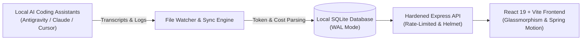

<div align="center">

# ⚡ KobeanAI Tracker

**Next-Generation, Local-First AI Observability & Telemetry Hub for Coding Assistants**

[]()
[]()
[]()
[]()
[]()
[]()
[]()

[Features](#-key-features) • [Architecture](#-architecture) • [Quick Start](#-quick-start) • [Multi-Repo Guide](#-multi-repo-contributor-workflow) • [Security](#-secret-leak-protection-betterleak) • [Tech Stack](#-tech-stack)

</div>

---

## 🌟 Overview

**KobeanAI Tracker** is a privacy-first, ultra-responsive observability platform designed for developers and open-source contributors who use AI assistants to code. It automatically traces, analyzes, and visualizes token usage, model pricing, execution latency, and agent trajectories across multiple repositories without transmitting your code to third-party servers.



---

## ✨ Key Features

- 🔒 **100% Local-First & Private**: All transcripts, session histories, tokens, and rules stay strictly on your local machine in SQLite. Zero cloud exfiltration.
- 🤖 **Universal Multi-Agent Telemetry**: Native parsers for **Google Antigravity**, **Claude Code / Desktop**, **Cursor IDE**, and **GitHub Copilot**.
- 📊 **Real-Time Token & Cost Modeling**: Accurately calculates input/output tokens, subagent tool calls, and dollar costs across Gemini 1.5 Pro, Claude 3.5 Sonnet, and OpenAI models.
- 🌊 **Fluid Glassmorphic UI (`taste-skill`)**: Sleek dark/light themes, spring physics curves (`--ease-spring-smooth`), live telemetry pulsing indicators, and interactive card elevations.
- 🧠 **Anti-Overengineering Framework (`ponytail`)**: Built-in 6-step Decision Ladder enforcing YAGNI, standard library first, native platform capabilities, and zero bloated packages.
- 🛡️ **Secret Leak Prevention (`.betterleak`)**: Active secret detection rules protecting API keys (OpenAI, Anthropic, Gemini, AWS, GitHub PATs) in pre-commit hooks and CI.
- 🔄 **One-Click Telemetry Sync**: Real-time daemon watcher plus on-demand re-scanning for historical logs.
- 🐳 **Production-Ready & Containerized**: Includes multi-stage Docker build, Docker Compose, automated CI pipeline, and health probes (`/api/health`).

---

## 🚀 Quick Start

### 1. Prerequisites
- **Node.js**: v20.x or higher
- **Package Manager**: npm, pnpm, or yarn
- **Git**

### 2. Clone and Install
```bash
# Clone repository
git clone https://github.com/thienng-it/KobeanAI-tracker.git
cd KobeanAI-tracker

# Install dependencies
npm install
```

### 3. Start Development Server
```bash
npm run dev
```
Open **[http://localhost:5173](http://localhost:5173)** in your browser. The backend API runs concurrently on port `3000`.

---

## 🐳 Running with Docker

Run the entire full-stack application inside a lightweight container:

```bash
# Build and run container in background
docker compose up -d

# Check health
curl http://localhost:3000/api/health
```

Access the application at **[http://localhost:3000](http://localhost:3000)**.

---

## 🐙 Multi-Repo Contributor Workflow

If you contribute to multiple GitHub repositories and use AI to code:

1. **Keep KobeanAI Tracker Running**: Run `npm run dev` or `docker compose up -d` in the background. KobeanAI Tracker will automatically capture AI transcripts generated in any directory.
2. **Tag Sessions by Project in Prompts**: Prefix your prompts with repository or issue identifiers:
   ```text
   [repo:facebook/react][issue-1234] Refactor useState hook microtask queue
   ```
   KobeanAI Tracker parses bracketed tags and enables instant per-repository filtering in the **Sessions Table**.
3. **Sync Real Logs**: Go to the **Sessions** page and click **"Sync Real Logs"** to instantly ingest and recalculate figures from disk transcripts.

---

## 🛡️ Secret Leak Protection (`.betterleak`)

Protect your sensitive API tokens across all public and private repositories:

```bash
# Install simple pre-commit hook in your repo
cat << 'EOF' > .git/hooks/pre-commit
#!/bin/sh
echo "🔍 Checking for sensitive secrets..."
git diff --cached | grep -E "(AIzaSy[0-9A-Za-z_-]{33}|sk-ant-[a-zA-Z0-9_-]{20,}|sk-[a-zA-Z0-9]{32,})"
if [ $? -eq 0 ]; then
  echo "❌ Sensitive API token detected in staged files! Aborting commit."
  exit 1
fi
EOF
chmod +x .git/hooks/pre-commit
```

---

## 🛠️ Tech Stack

| Layer | Technology |
| :--- | :--- |
| **Frontend** | React 19, TypeScript, Vite 6, Zustand, Lucide React, Recharts |
| **Styling** | Vanilla CSS Design Tokens, Glassmorphism, Spring Curves |
| **Backend** | Node.js, Express 5, Chokidar File Watcher, Helmet, Express Rate Limit |
| **Database** | SQLite via `better-sqlite3`, Drizzle ORM (WAL Mode) |
| **Security & CI** | `.betterleak`, Gitleaks, GitHub Actions CI |
| **DevOps** | Multi-Stage Dockerfile, Docker Compose |

---

## 📂 Project Structure

```text
KobeanAI-tracker/
├── .agents/                    # Ponytail & Taste-Skill plugins and rules
├── .betterleak                 # Secret scanning detection patterns
├── .github/workflows/ci.yml    # CI build and secret check pipeline
├── server/                     # Backend Express server & DB
│   ├── connectors/             # Multi-agent transcript watchers
│   ├── db/                     # Drizzle schema, migrations & SQLite DB
│   ├── middleware/             # Centralized error handler & security
│   ├── routes/                 # REST API endpoints (sessions, agents, health)
│   └── services/               # Telemetry aggregation service
├── src/                        # Frontend React application
│   ├── components/             # Reusable UI & dashboard components
│   ├── pages/                  # Dashboard, Sessions, Docs, Setup, Config
│   ├── stores/                 # Zustand state stores (persisted)
│   └── index.css               # Global motion tokens & design system
├── Dockerfile                  # Multi-stage production container
└── docker-compose.yml          # Single-command container deployment
```

---

## 📄 License

This project is licensed under the **MIT License** - see the [LICENSE](LICENSE) file for details.

<div align="center">
Built with ❤️ by <strong><a href="https://github.com/thienng-it">thienng-it</a></strong>
</div>