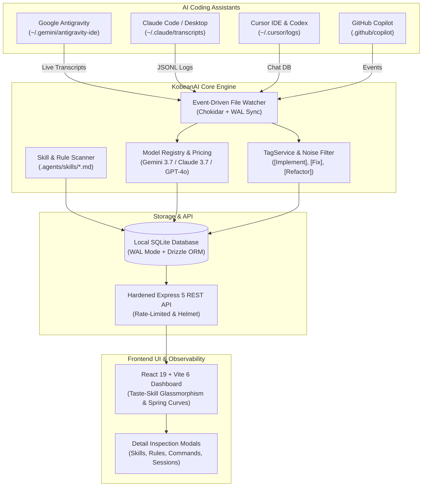

<div align="center">

# ⚡ KobeanAI Tracker

**Next-Generation, Local-First AI Observability & Telemetry Hub for Autonomous Coding Assistants**

[]()
[]()
[]()
[]()
[]()
[]()
[]()
[](https://thienng-it.github.io/KobeanAI-tracker/docs)

📖 **[Live Documentation & Online Guide](https://thienng-it.github.io/KobeanAI-tracker/docs)** • 📚 **[In-App Wiki & Knowledge Base](http://localhost:5173/wiki)**

[Features](#-key-features) • [Architecture](#-architecture) • [Multi-Agent Standards](#-multi-agent-compatibility--standards) • [Quick Start](#-quick-start) • [Multi-Repo Workflow](#-multi-repo-contributor-workflow) • [Security](#-secret-leak-protection-betterleak) • [Tech Stack](#-tech-stack)

</div>

---

## 🌟 Overview

**KobeanAI Tracker** is a privacy-first, ultra-responsive observability platform and agent management hub designed for developers and engineering teams who build software with AI assistants. It automatically traces, analyzes, and visualizes token usage, model pricing, execution latency, and agent trajectories across multiple repositories without transmitting your source code or keys to third-party servers.



---

## ✨ Key Features

- 🔒 **100% Local-First & Zero Cloud Lock-In**: All transcripts, session histories, tokens, and rules stay strictly on your workstation in SQLite. Zero telemetry exfiltration.
- 🤖 **Universal Cross-Agent Compatibility**: Native connectors and parsers for **Google Antigravity**, **Claude Code (Anthropic)**, **Cursor IDE**, and **GitHub Copilot**.
- 📊 **Granular Model Observability & Telemetry**: Per-model statistics isolation, token breakdowns (input, output, cache read/write, thinking loops), latency tracking, and exact cost computation.
- 🏷️ **Canonical Intent Taxonomy & Noise Filtering**: Automatic categorization into `[Implement]`, `[Fix]`, `[Refactor]`, `[UI/UX]`, `[Docs]`, `[Validate]`, and `[Config]` while filtering transient noise.
- 🧠 **Universal Prompt Skill & Rule Management**: Manage and create prompt skills, behavioral guardrails, and slash commands with automatic two-way disk synchronization into `.agents/skills/<name>/SKILL.md`.
- ⌘ **Slash Command Registry**: Map shortcut commands (`/goal`, `/schedule`, `/grill-me`, `/learn`) with one-click invocation copy and linked skill execution.
- 🌊 **Fluid Taste-Skill UI**: Sleek dark/light themes, spring physics curves (`cubic-bezier(0.16, 1, 0.3, 1)`), live telemetry pulsing indicators, and glassmorphic detail inspection modals.
- 🛡️ **Secret Leak Prevention (`.betterleak`)**: Active secret scanning preventing accidental commits of OpenAI, Anthropic, Gemini, AWS, or GitHub keys.
- 🐳 **Production-Ready & Containerized**: Multi-stage Docker build, Docker Compose, automated CI pipeline, and health probes (`/api/health`).

---

## 🤖 Multi-Agent Compatibility & Standards

KobeanAI Tracker unifies configuration across all major AI agent architectures:

| AI IDE / Assistant | Configuration Format | Progressive Skills | Tool / MCP Config |
| :--- | :--- | :--- | :--- |
| **Google Antigravity** | `.agents/`, `GEMINI.md`, `AGENTS.md` | `.agents/skills/<name>/SKILL.md` | `.agents/mcp_config.json`, `hooks.json` |
| **Claude Code (Anthropic)** | `.claude/`, `CLAUDE.md` | `.claude/skills/`, `.claude/commands/` | `.claude/settings.json`, `config.json` |
| **Cursor IDE** | `.cursor/`, `.cursorrules` | `.cursor/rules/*.mdc` | `.cursor/mcp.json` |
| **GitHub Copilot** | `.github/` | `.github/copilot-instructions.md` | VS Code settings |
| **Windsurf / OpenCode** | `.windsurf/`, `.windsurfrules` | `.windsurf/memories/` | `.windsurf/mcp_config.json` |

---

## 🚀 Quick Start

### 1. Prerequisites
- **Node.js**: v20.x or higher
- **Package Manager**: npm, pnpm, or yarn
- **Git**

### 2. Clone and Install
```bash
# Clone repository
git clone https://github.com/thienng-it/KobeanAI-tracker.git
cd KobeanAI-tracker

# Install dependencies
npm install
```

### 3. Start Development Server
```bash
npm run dev
```
Open **[http://localhost:5173](http://localhost:5173)** in your browser. The backend API runs concurrently on port `3000`.

### 4. Run Desktop Electron App (Optional)
```bash
npm run desktop:dev
```

---

## 🐳 Running with Docker

Run the entire full-stack application inside a lightweight container:

```bash
# Build and run container in background
docker compose up -d

# Check container health probe
curl http://localhost:3000/api/health
```

Access the dashboard at **[http://localhost:3000](http://localhost:3000)**.

---

## 🐙 Multi-Repo Contributor Workflow

If you contribute to multiple repositories and use AI to code:

1. **Keep KobeanAI Tracker Running**: Run `npm run dev` or `docker compose up -d` in the background. KobeanAI Tracker automatically captures AI transcripts generated in any workspace directory.
2. **Tag Sessions by Project in Prompts**: Prefix your prompts with repository or intent tags:
   ```text
   [repo:facebook/react][issue-1234][Fix] Resolve race condition in useEffect cleanup
   ```
   KobeanAI Tracker parses bracketed tags and enables instant per-repository and per-intent filtering in the **Sessions Table** and **Dashboard Charts**.
3. **One-Click Real-Time Sync**: Click **"Sync System Skills"**, **"Sync System Rules"**, or **"Sync Logs"** on any page to immediately ingest and recalculate figures from disk transcripts.

---

## 🛡️ Secret Leak Protection (`.betterleak`)

Protect your sensitive API tokens across all public and private repositories before staging commits:

```bash
# Install automated pre-commit hook
cat << 'EOF' > .git/hooks/pre-commit
#!/bin/sh
echo "🔍 Running .betterleak secret scan..."
git diff --cached | grep -E "(AIzaSy[0-9A-Za-z_-]{33}|sk-ant-[a-zA-Z0-9_-]{20,}|sk-[a-zA-Z0-9]{32,})"
if [ $? -eq 0 ]; then
  echo "❌ Sensitive API token detected in staged files! Aborting commit."
  exit 1
fi
echo "✅ No sensitive secrets detected."
EOF
chmod +x .git/hooks/pre-commit
```

---

## 🛠️ Tech Stack

| Layer | Technology | Rationale |
| :--- | :--- | :--- |
| **Frontend** | React 19, TypeScript, Vite 6, Zustand, Lucide React, Recharts | Zero-overhead modern frontend with reactive stores |
| **Styling** | Vanilla CSS Design Tokens, Glassmorphism, Spring Curves | Ultra-smooth micro-interactions, hardware-accelerated transforms |
| **Backend** | Node.js, Express 5, Chokidar Watcher, Helmet, Rate Limiter | High-throughput local API with hardened security |
| **Database** | SQLite via `better-sqlite3`, Drizzle ORM (WAL Mode) | Blazing-fast concurrency with local file durability |
| **Desktop** | Electron 35 | Native cross-platform desktop wrapper |
| **DevOps & CI** | Multi-Stage Dockerfile, Docker Compose, GitHub Actions | Single-command deployment and automated CI tests |

---

## 📂 Project Structure

```text
KobeanAI-tracker/
├── .agents/                    # Progressive disclosure skills, rules & plugins
│   ├── rules/                  # Behavioral guardrails (model-observability, session-tags)
│   └── skills/                 # Ponytail, codegraph, taste-skill SKILL.md files
├── .betterleak                 # Secret scanning detection regex patterns
├── server/                     # Backend Express server & SQLite database
│   ├── connectors/             # Antigravity, Claude, Cursor transcript watchers
│   ├── db/                     # Drizzle schema, migrations & SQLite DB
│   ├── routes/                 # REST API endpoints (sessions, skills, rules, commands)
│   └── services/               # ModelRegistry, TagService, WorkspaceService, DateUtils
├── src/                        # Frontend React application
│   ├── components/             # Reusable UI, charts, modals, toolbars
│   ├── pages/                  # Dashboard, Sessions, Skills, Rules, Commands, Docs, Wiki
│   ├── stores/                 # Zustand state stores (persisted telemetry)
│   └── index.css               # Global spring tokens & glassmorphic design system
├── Dockerfile                  # Multi-stage production container
└── docker-compose.yml          # Containerized deployment manifest
```

---

## 📄 License

This project is licensed under the **MIT License** - see the [LICENSE](LICENSE) file for details.

<div align="center">
Built with ❤️ by <strong><a href="https://github.com/thienng-it">thienng-it</a></strong>
</div>