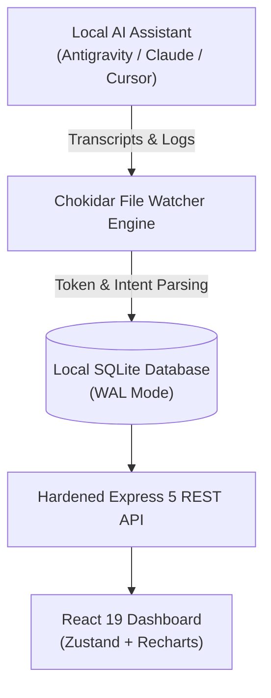

# ⚡ KobeanAI Tracker — Knowledge Base & Engineering Wiki

Welcome to the official **KobeanAI Tracker Wiki**. This documentation hub provides in-depth technical specifications, architectural blueprints, progressive disclosure schemas, model pricing equations, and developer guides.

---

## 📚 Quick Navigation

### 🏗️ Architecture & Core Engine
* [[System Architecture & Data Flow]] — SQLite in WAL mode, event-driven transcript file watchers (`chokidar`), and local data privacy.
* [[Model Observability & Pricing Math]] — Token pricing calculations (Gemini 3.7, Claude 3.7, GPT-4o), context windows, subagent tool calls, and thinking loops.
* [[Canonical Intent Taxonomy]] — The 7-tier intent standard (`[Implement]`, `[Fix]`, `[Refactor]`, `[UI/UX]`, `[Docs]`, `[Validate]`, `[Config]`) and noise filtering.

### 🤖 Multi-Agent Configuration Standards
* [[Multi-Agent Configuration Standards]] — Universal `.agents/`, `.claude/`, `.cursor/`, and `.github/` folder structures and `SKILL.md` YAML frontmatter schemas.
* [[Ponytail Engineering Standards]] — Anti-overengineering framework and the 6-step Decision Ladder.
* [[Taste-Skill Motion & UI Guidelines]] — Spring curve easing `cubic-bezier(0.16, 1, 0.3, 1)`, glassmorphism panels, and keycap badges.

### 🛡️ Security & Reliability
* [[Secret Leak Prevention (.betterleak)]] — Active secret regex patterns, pre-commit hooks, and CI protection.
* [[Troubleshooting & FAQ]] — Common transcript paths, port overrides, and database resets.

---

## 🌟 High-Level Data Flow



---

## 🚀 Getting Started
To spin up KobeanAI Tracker locally:
```bash
git clone https://github.com/thienng-it/KobeanAI-tracker.git
cd KobeanAI-tracker
npm install
npm run dev
```
Open **[http://localhost:5173](http://localhost:5173)** in your browser.
