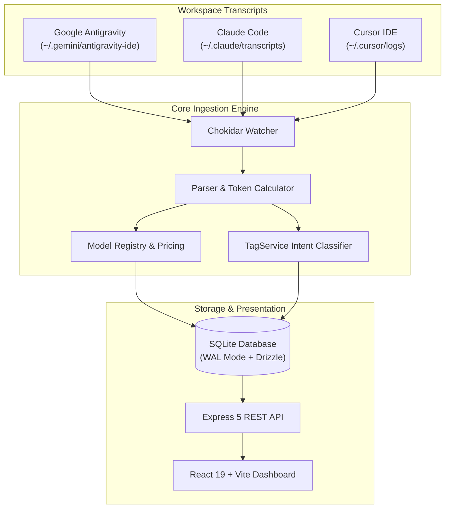

# System Architecture & Local Data Flow

KobeanAI Tracker is engineered from the ground up to be **100% Local-First, Private, and High-Throughput**.

---

## 1. Core Architecture Principles

1. **Zero External Telemetry**: Your source code, API keys, and conversational transcripts never leave your machine.
2. **SQLite in WAL Mode**: SQLite operates with \`PRAGMA journal_mode = WAL\` for non-blocking concurrent reads and lightning-fast writes.
3. **Event-Driven File Watchers**: Uses Node.js \`chokidar\` to monitor local filesystem transcript changes without CPU-heavy polling loops.

---

## 2. Ingestion Connectors

### Google Antigravity Connector
* **Stream Location**: `~/.gemini/antigravity-ide/brain/<conversation-id>/.system_generated/logs/transcript.jsonl`
* **Parsing**: Extracts `step_index`, `source`, `type` (`USER_INPUT`, `PLANNER_RESPONSE`), token metrics, subagent spawns, and thinking iterations.

### Claude Code Connector
* **Stream Location**: `~/.claude/transcripts/*.jsonl`
* **Parsing**: Ingests multi-turn conversational traces, token usage, tool invocations, and cost breakdowns.

### Cursor IDE Connector
* **Stream Location**: `~/.cursor/logs` or `state.vscdb`
* **Parsing**: Extracts multi-file edit events and context token counts.
